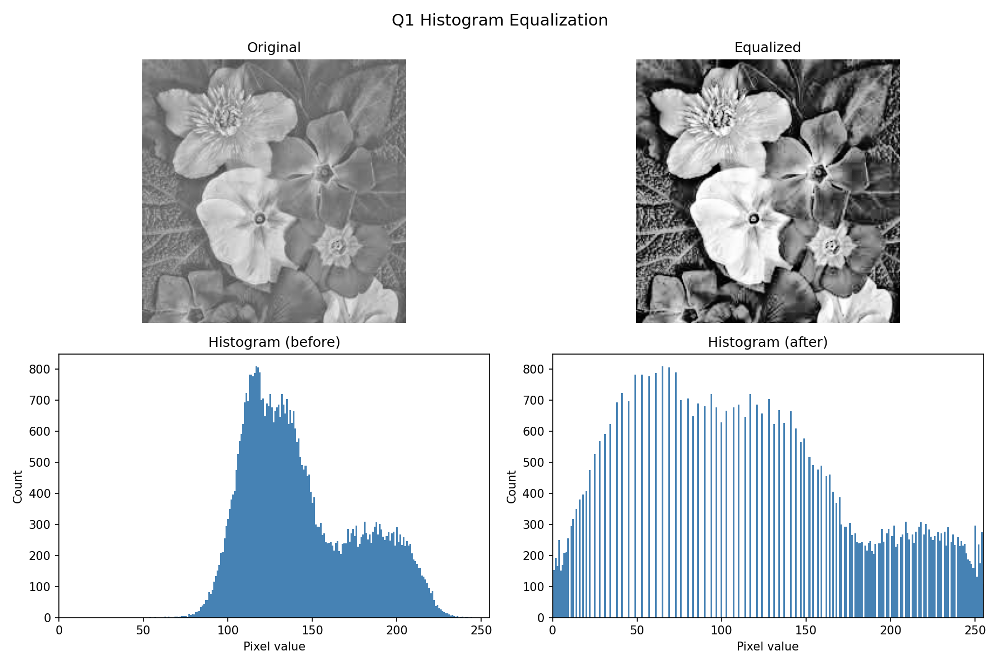
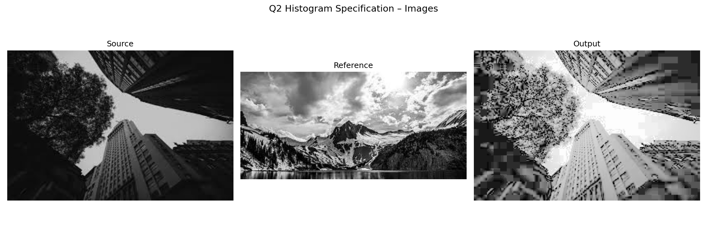
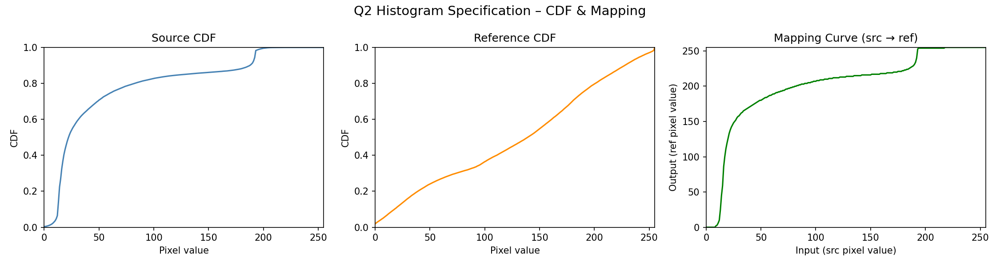
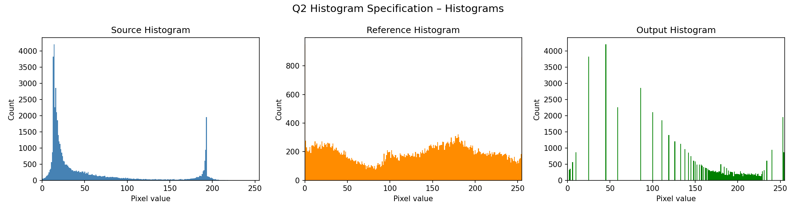
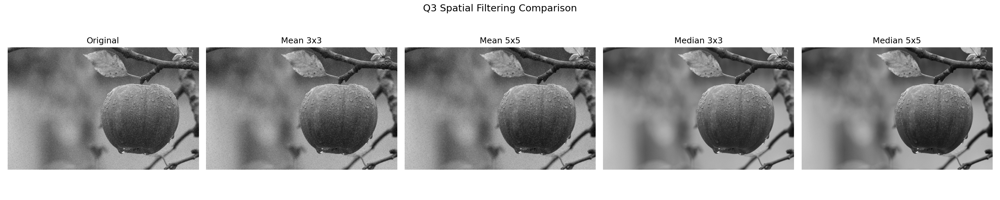
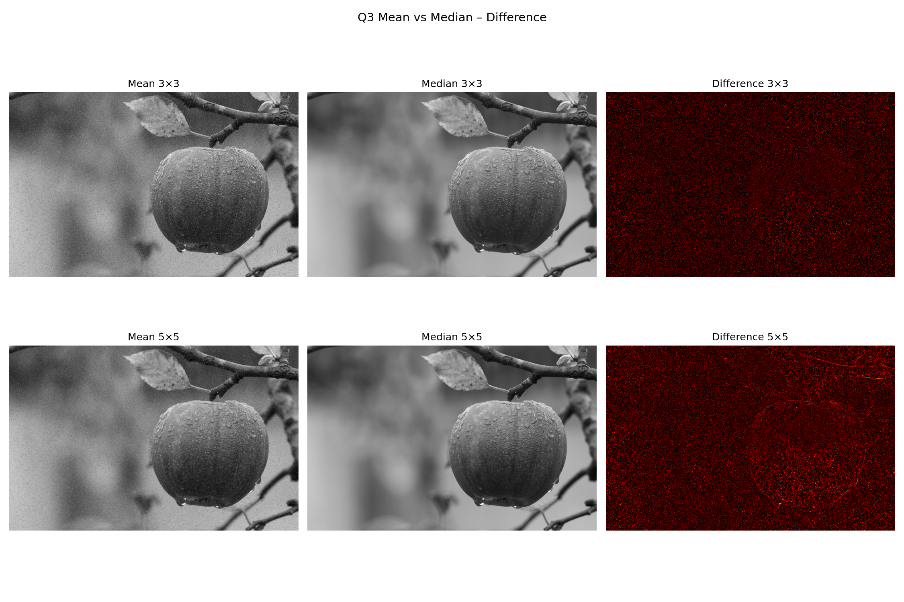

# Image Processing HW2 — Histogram & Spatial Filtering

This homework implements three classic image processing techniques **from scratch** using NumPy (no OpenCV processing functions). All algorithms operate on grayscale images.

---

## Project Structure

```
HW2/
├── utils.py                    # Shared helpers (load, save, histogram, plot)
├── histogram_equalization.py   # Q1 – Histogram Equalization
├── histogram_specification.py  # Q2 – Histogram Specification
├── spatial_filtering.py        # Q3 – Mean & Median Spatial Filtering
├── Q1.jpg                      # Input for Q1
├── Q2_src.jpg                  # Source image for Q2
├── Q2_ref.jpg                  # Reference image for Q2
├── Q3.jpg                      # Input for Q3
└── output/                     # All generated results
```

## How to Run

```bash
# Install dependencies
pip install numpy matplotlib opencv-python

# Run each question independently
python histogram_equalization.py
python histogram_specification.py
python spatial_filtering.py
```

All output images are written to the `output/` directory automatically.

---

## Q1 — Histogram Equalization

**Goal:** Enhance the contrast of a low-contrast grayscale image by redistributing pixel intensities across the full [0, 255] range.

**Algorithm (`histogram_equalization.py`):**

1. Compute the histogram `H[v]` — count of pixels with intensity `v`.
2. Compute the cumulative distribution function (CDF): `CDF[v] = Σ H[0..v]`.
3. Build a mapping using the equalization formula:

$$T(v) = \text{round}\!\left(\frac{CDF(v) - CDF_{\min}}{N - CDF_{\min}} \times 255\right)$$

where `N` is the total number of pixels and `CDF_min` is the smallest non-zero CDF value.

4. Apply the mapping to every pixel: `output[r,c] = T(input[r,c])`.

**Result:**



The left column shows the original dark image and its histogram (pixels concentrated in low intensities). The right column shows the equalized image and its spread-out histogram, demonstrating significant contrast improvement.

---

## Q2 — Histogram Specification (Histogram Matching)

**Goal:** Transform the pixel distribution of a **source** image so that it matches the histogram of a **reference** image, rather than forcing a uniform distribution.

**Algorithm (`histogram_specification.py`):**

1. Compute the normalized CDF of both the source and reference images.
2. For each source intensity `s`, find the reference intensity `r` that satisfies `CDF_ref(r) ≈ CDF_src(s)` using linear interpolation (`np.interp`).
3. This builds a mapping curve `src_pixel → ref_pixel`.
4. Apply the mapping to transform the source image.

**Images (Source → Reference → Output):**



**CDF & Mapping Curve:**



- **Blue** — Source CDF (steeper, biased toward darker tones)
- **Orange** — Reference CDF (target distribution)
- **Green** — Resulting mapping curve applied to source pixels

**Histograms Comparison:**



The output histogram (green) closely matches the shape of the reference histogram (orange), confirming a successful match.

---

## Q3 — Spatial Filtering (Mean & Median)

**Goal:** Apply mean and median spatial filters with two kernel sizes (3×3, 5×5) to a noisy grayscale image and compare their smoothing effects.

**Algorithm (`spatial_filtering.py`):**

```
apply_filter(img, ksize, mode):
    1. Pad image edges by ksize//2 pixels (edge-replication padding)
    2. For every pixel (r, c):
         region = padded[r : r+ksize, c : c+ksize]   # ksize×ksize neighborhood
         if mode == "mean":
             output[r,c] = round(mean(region))
         else:  # median
             output[r,c] = median(region)
    3. Return output clamped to [0, 255]
```

Both filters are implemented **without** any OpenCV/SciPy filtering calls — only NumPy array operations.

**All Filters Side-by-Side:**



| Filter | Behavior |
|---|---|
| Mean 3×3 | Mild smoothing; blurs edges slightly |
| Mean 5×5 | Stronger smoothing; more pronounced blur |
| Median 3×3 | Removes impulse noise while preserving edges better |
| Median 5×5 | Aggressive noise removal; edges still sharper than mean |

**Mean vs. Median Difference Maps:**



The hot-color difference maps highlight where the two filter types disagree most. Bright regions (high difference) correspond to edges and isolated noisy pixels — areas where the median filter's non-linear behavior diverges from the mean's averaging.

---

## Key Takeaways

| Technique | Input | Core Operation | Use Case |
|---|---|---|---|
| Histogram Equalization | Low-contrast image | CDF-based intensity remapping | General contrast enhancement |
| Histogram Specification | Source + Reference | CDF matching via interpolation | Style/tone transfer between images |
| Mean Filter | Noisy image | Local average | Gaussian-like smoothing |
| Median Filter | Noisy image | Local median | Salt-and-pepper noise removal |
