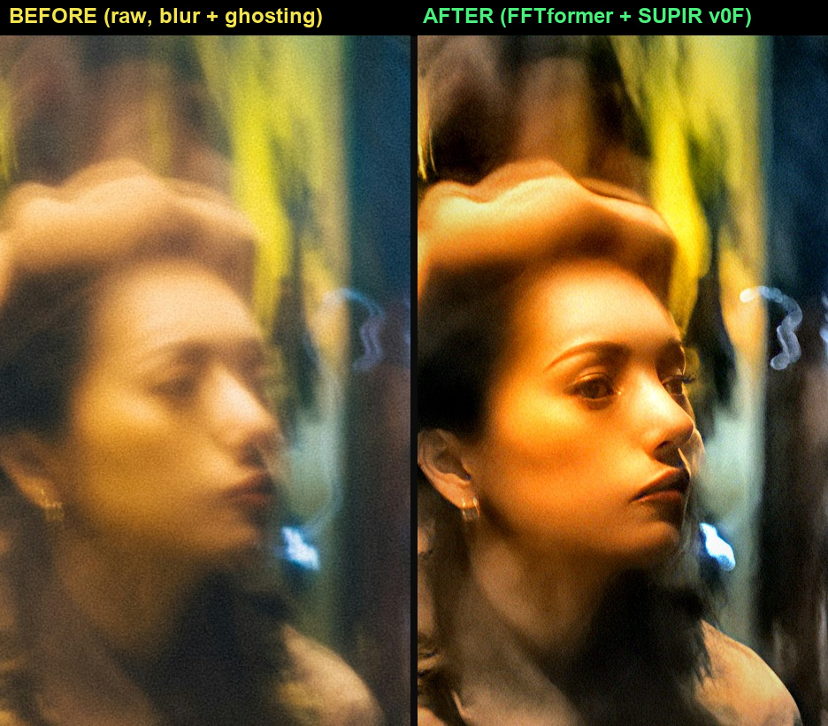

# 影像處理 Term Project — 夜間運動模糊的人臉修復

NYCU 影像處理 · Term Project

**組員**：113950011 鄭名翔 · [id] [teammate] · [id] [teammate]

---

## 任務

15 張夜間 / 低光、含 motion blur 的真實照片（6K–8K，無 ground truth）。作業範例展示的是「模糊人臉 → 清晰人臉」，我們以此為目標，自選 2 張最佳結果繳交。

挑戰：低光 + noise + 大尺度 blur kernel + 高解析度 + 夜景 OOD。目標是做出可信、且前後差異明顯的對比。

---

## 方法概要

基礎為 FFTformer (CVPR 2023) frequency-domain transformer 去模糊（RealBlur-J pretrained）。回歸式去模糊在臉部會遇到天花板：高頻被運動模糊抹除後，輸出偏軟、帶噪。我們在其上加生成式臉部先驗：

前處理（gamma/CLAHE/飽和度）→ 裁臉 → **FFTformer**（去運動模糊、提供結構）→ **SUPIR-v0F**（擴散先驗，高 control 補回臉部高頻）→ 羽化合成（背景保留動態模糊）→ 輕度調色（自寫 OpenCV/NumPy，非 Photoshop）。

<p align="center"></p>

完整方法、對照實驗與 fidelity 誠實聲明見 `report/Report.pdf`。

---

## 主要結果

繳交 2 張不同場景的「模糊路人 → 清晰真人臉」（呼應作業範例）：

<p align="center"></p>
<p align="center"></p>

**fidelity**：臉部清晰細節由 SUPIR 擴散先驗合成（prior-guided restoration），非逐像素解卷積。#1 男子五官 layout 在原圖中真實存在（先驗在真實結構上補高頻）；**#2 女子的眼睛 / 上半臉為生成**（原圖被運動重影破壞，無法真實還原）。完整聲明見 `report/Report.pdf` 第 5 節。

繳交檔位於 `final_submissions/Faces_2026-06-04/`。

---

## Repo 結構

```
.
├── README.md
├── requirements.txt                 deblur 環境 Python 套件
├── Term Project.pdf                 作業規格（課程材料）
├── Images/                          15 張原圖（題目提供，.gitignore 排除）
├── FFTformer/                       去模糊方法 checkout（.gitignore 排除，需 clone kkkls/FFTformer）
├── DarkIR/ · MISCFilter/            對比方法 checkout（.gitignore 排除）
├── scripts/                         程式碼
│   ├── run_face_restore.py          重現兩張繳交圖的完整管線
│   ├── supir_api.py                 headless 驅動 ComfyUI SUPIR
│   └── md_to_pdf.py                 Report.md -> Report.pdf
├── report/
│   ├── Report.md / Report.pdf       書面報告
│   ├── figures/                     報告用圖（face_*）
│   └── PPT_outline.md               課堂報告投影片大綱
├── final_submissions/
│   └── Faces_2026-06-04/            最終 2 張人臉 + 對比圖 + README
└── results/                         輸出（.gitignore 排除，可由腳本重跑）
```

---

## 復現（從頭設定）

repo 只含程式碼、報告與成品；原圖、模型權重、FFTformer 與 ComfyUI 都需自行準備。

**1. Python 套件（deblur 環境）**
`pip install -r requirements.txt`。FFTformer 推論另需 PyTorch；Blackwell sm_120（RTX 50xx）我們用 torch 2.11+cu128，請依自己的 GPU/CUDA 從 [pytorch.org](https://pytorch.org) 選對應 build。

**2. 原圖**
把助教提供的 15 張照片放進 `Images/`（`.gitignore` 排除，repo 不含）。

**3. FFTformer（去模糊）**
clone [kkkls/FFTformer](https://github.com/kkkls/FFTformer) 到專案根目錄的 `FFTformer/`，並把 RealBlur-J 權重放到 `FFTformer/pretrain_model/Realblur/net_g_Realblur_J.pth`。

**4. ComfyUI + SUPIR（獨立 comfy 環境）**
安裝 ComfyUI 與 [kijai/ComfyUI-SUPIR](https://github.com/kijai/ComfyUI-SUPIR) 節點（與 deblur 隔離以保護 sm_120 torch）。權重：`SUPIR-v0F_fp16.safetensors`（[Kijai/SUPIR_pruned](https://huggingface.co/Kijai/SUPIR_pruned)）+ SDXL 底模 `RealVisXL_V4.0_Lightning.safetensors`。

**5. 跑**
```bash
# 啟動 ComfyUI SUPIR server（comfy env）
python <ComfyUI>/main.py --port 8188
# 一鍵重現兩張繳交圖（deblur env；內部呼叫 FFTformer 與 supir_api.py，
# 完成後寫入 final_submissions/Faces_2026-06-04/）
python scripts/run_face_restore.py
```

**換機器時的路徑覆寫**：腳本路徑皆由 `__file__` 推導；下列環境變數可覆寫預設（都有合理預設值）——`COMFY_PYTHON`（comfy 環境 python）、`FFTFORMER_DIR`、`COMFYUI_DIR`、`COMFYUI_SERVER`（預設 `http://127.0.0.1:8188`）、`CHROME_PATH`（`md_to_pdf.py` 用）。

`run_face_restore.py` 的 `FACES` 設定記錄每張臉的裁切框、前處理與 SUPIR 參數。限制與未來方向見 `report/Report.pdf` 第 7 節。
