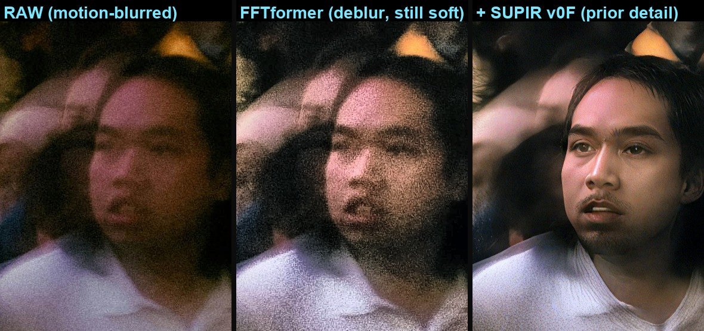
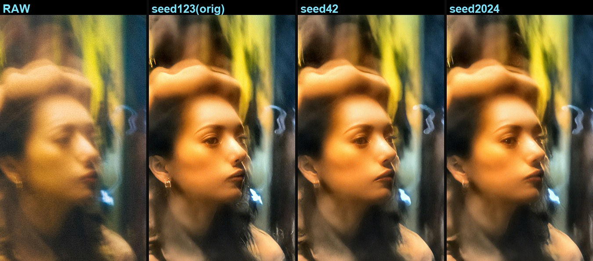
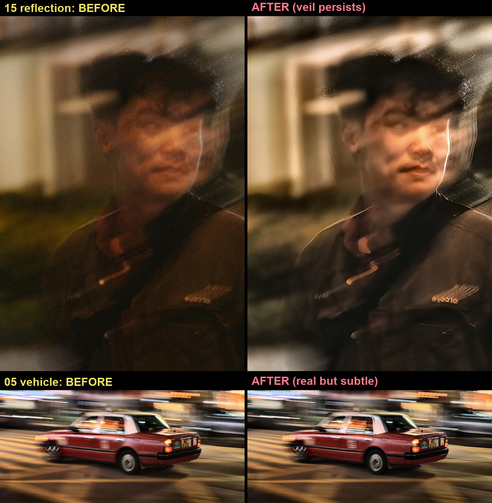

# 夜間運動模糊的人臉修復：回歸式去模糊結合生成式先驗

NYCU 影像處理 · Term Project

組員：113950011 鄭名翔 · [id] [teammate] · [id] [teammate]（方法設計、實驗與報告由三人共同完成）

---

## 摘要

題目提供 15 張夜間真實照片（6K–8K、含運動模糊、無 ground truth），作業範例展示的是模糊人臉修復成清晰人臉，我們便以人臉修復為目標。做法是先用 FFTformer (CVPR 2023) 去除運動模糊，再用 SUPIR (CVPR 2024) 的擴散先驗補回回歸模型無法還原的臉部高頻，流程為：裁臉、FFTformer 去模糊、SUPIR-v0F 補細節、羽化合成回原圖。最後選出兩個不同場景的路人臉繳交：#1 的五官位置在原圖中仍可辨識，先驗只負責補高頻細節；#2 的眼睛與上半臉已被運動重影破壞，屬於生成內容，我們在報告與繳交說明中都標明了這一點。

---

## 1. 任務與挑戰

輸入為 15 張夜間 / 低光、含運動模糊 (motion blur) 的真實照片，解析度 6K–8K，無 ground truth，因此不能用 PSNR / SSIM，只能靠 No-Reference IQA 與人眼互評。難處在於低光、雜訊、大尺度模糊核 (blur kernel) 與高解析度同時出現，而且夜景對多數去模糊模型來說屬於訓練分布之外。作業投影片的範例是模糊人臉修復成清晰人臉，我們用同樣的標準挑選主體：能真實還原的就還原；被運動重影破壞、無法還原的部分改以生成補上並標明（見第 5 節）。我們沒有把整張畫面修清楚——背景保留的動態模糊反而保住夜景原有的速度感。

---

## 2. 採用的論文方法

管線用到兩個開源、實際跑通的已發表方法，符合作業「能成功執行某篇論文方法」的要求：

- **FFTformer (CVPR 2023)**：把 self-attention 與 feed-forward 移到頻域 (FFT) 計算的去模糊 transformer，論文在 RealBlur-J 上報告了當時最佳成績。我們使用其 RealBlur-J 預訓練權重 `net_g_Realblur_J.pth`。
- **SUPIR (CVPR 2024)**：以 SDXL 擴散先驗做影像修復，我們使用其 v0F 權重。

DarkIR (CVPR 2025) 與 MISCFilter (CVPR 2024) 也成功執行並在同一批影像上測過：前者實測以提亮、去噪為主，後者去模糊幅度有限，因此未採用。

只靠回歸式去模糊有其極限。FFTformer 學的是 blur 到 sharp 的映射，當高頻已被運動模糊抹除（臉部正是高頻密集的區域），模型沒有資訊可還原，輸出偏軟且帶噪。下圖中欄就是這個現象，也是我們在後面再接一段生成式先驗的原因。

*夜市男子的三欄對照：RAW｜FFTformer｜FFTformer→SUPIR。FFTformer 把臉的結構整理乾淨，但仍偏軟、噪點明顯；臉部高頻要靠 SUPIR 的擴散先驗才補得回來。*

---

## 3. 方法與改進點

我們的改進不在單一模型本身，而是把回歸式去模糊與生成式先驗組成針對人臉的兩階段管線，並依每張影像的模糊程度與 16 GB 顯存限制調整流程。每張臉的處理步驟如下：

1. **前處理與裁臉**：整張先做輕量前處理調整亮度、局部對比與飽和度（gamma / CLAHE / 飽和度，男子 0.85 / 3.0 / 1.10，女子 0.78 / 3.5 / 1.15），再於 native 解析度裁出人臉，保住最高的臉部有效解析度。
2. **Stage 1 — FFTformer (RealBlur-J)** 去運動模糊，給出乾淨的臉部結構。輸入解析度依模糊核大小決定：女子的運動核大，先縮到 max-side 1024 讓核回到模型可處理的範圍；男子裁切小、模糊輕，直接在 native 解析度處理。
3. **Stage 2 — SUPIR-v0F**（SDXL 擴散先驗）在乾淨結構上合成臉部高頻。control_scale 固定 1.0，取樣全程錨定在輸入結構上以壓制幻覺；其餘參數逐張調整：男子 cfg 1.5、放大 ×2.0、steps 10，女子 cfg 1.3、放大 ×1.5、steps 14。色彩以 Wavelet color fix 對齊輸入，16 GB 顯存靠 tiled VAE 與 tiled sampling 跑完。
4. **合成**：男子把修復的臉羽化合成回前處理後的全圖；女子取 SUPIR 結果的緊裁切，排除裁切框邊緣的幻覺殘影（見第 6 節）。臉部清晰、背景保留動態模糊，對照圖因此是同一張照片的主體 before / after，而不是整張重算。
5. **輕度調色（呈現層，非修復步驟）**：用 OpenCV / NumPy 做對比、暖調與主體暈影，未使用 Photoshop 等非開源工具；同時輸出未調色版（`*_FINAL_ungraded.png`），把去模糊與調色的貢獻分開。

---

## 4. 結果與評估

最終自選 2 張不同場景的人臉修復繳交，檔案在 `final_submissions/Faces_2026-06-04/`。

*#1 夜市男子（正面）：清晰的臉從動態模糊的人群中浮現，背景保留原有的動態模糊。*

*#2 霓虹巷弄女子（3/4 側臉，影像 14 主體的裁切）：兩張中前後對比最大的一張；眼部屬生成內容（見第 5 節），頭頂的運動重影保留為柔和的動態模糊。*

評估方式：本題無 ground truth，PSNR / SSIM 不可用；NIQE、MUSIQ 一類的 No-Reference 指標各有設計偏好，而且沒有參考影像可比，分不出「真實還原」與「生成幻覺」——對生成補出來的臉反而可能給高分。因此我們不列 NR-IQA 分數，以 native 解析度下的人眼檢查與課程的同儕互評為準。支持方法設計的證據是第 2 節的消融對照（FFTformer-only vs FFTformer→SUPIR）與第 6 節的失敗案例。

---

## 5. 哪些是真實還原、哪些是生成

兩張臉的高頻細節都來自擴散先驗的合成（prior-guided restoration，與 GFPGAN / GPEN 這類先驗導引的人臉修復屬同一範式，差別在 GAN 先驗與擴散先驗），不是逐像素的解卷積。兩張的差別在於原圖留下多少真實結構可以約束生成：

- **#1 夜市男子**：雙眼、鼻、口、髮際在原圖中仍可辨識（單向運動模糊、無重影）。高頻細節雖由先驗合成，但 control_scale 1.0 的取樣全程緊貼輸入結構，五官位置幾乎沒有偏離原圖的空間。
- **#2 霓虹女子**：下半臉（鼻、唇、下巴、耳環）有真實結構可依；但頭部帶運動重影 (double-image)，眼睛與上半臉的高頻已被物理性抹除，這一區的細節是在缺乏真實依據的情況下生成的。

*不同隨機種子重跑 #2：有真實結構約束的部位（下巴輪廓、3/4 側臉姿態）在各 seed 間大致一致。但 SUPIR 提示詞指定了「對稱雙眼」與「耳環」，這兩項的一致性有一部分來自提示詞；而且種子間一致只代表生成受到約束，不代表與本人相符。*

對 #2，我們的取捨是把視覺對比放在保真度之前：眼睛已超出可信還原的範圍，所以在本報告、繳交說明（`final_submissions` 內的 README）與互評說明中都標明該區為生成內容，不把它當成真實像素。

---

## 6. 驗證過、未採用的方向

- **玻璃反射（影像 15 攝影師）**：反射疊影屬於 layer separation 問題而非模糊，FFTformer 與 SUPIR 都移除不了，臉仍然朦朧（上圖上排）。
- **純車輛去模糊（影像 05 紅色計程車、08 速食店招牌）**：FFTformer 的去模糊真實、完全不含生成內容，但這些主體在原圖中本就部分可辨，修復前後的差距不大（上圖下排）。
- **整張影像直接跑 SUPIR**：背景人群會被幻覺成扭曲的臉；影像 14 整圖修復時甚至在主體旁長出第二張臉。繳交的 #2 因此改為先裁臉再緊裁切，而非整圖修復。

---

## 7. 限制與未來方向

- 玻璃反射 / 多重曝光（影像 02、15）本質是 layer separation，需要 reflection removal 一類的方法。
- 生成式修復的保真度有上限：被運動重影抹除的五官（#2 的眼睛與上半臉）無法真實還原，只能在標示清楚的前提下生成。
- 後續可嘗試臉部專用修復模型（如 CodeFormer、GFPGAN，附 fidelity 參數可調整生成程度），或以真實成對的夜間模糊資料微調。

## 8. 復現

- 環境：`deblur` conda env（FFTformer，PyTorch 2.11+cu128，RTX 5070 Ti）與 `comfy` conda env（ComfyUI + SUPIR）。兩者的相依套件互相衝突，因此拆成兩個環境，由主腳本跨環境呼叫。
- 模型：FFTformer RealBlur-J、SUPIR-v0F；SUPIR 的 SDXL 底模為 RealVisXL V4.0 Lightning。
- 重現方式：先啟動 ComfyUI SUPIR server，再執行 `python scripts/run_face_restore.py`，兩張成品會寫入 `final_submissions/Faces_2026-06-04/`；每張臉的裁切框與全部參數記錄在腳本開頭的 `FACES` 設定。
