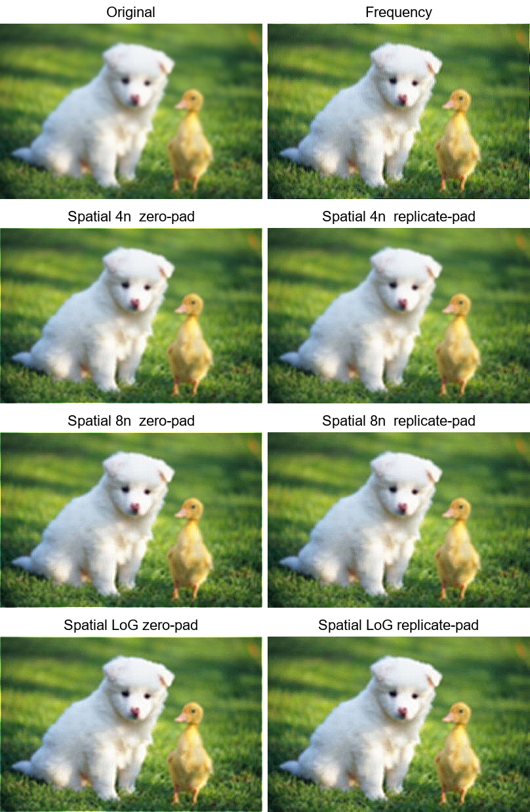
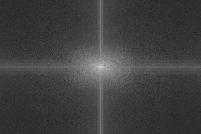
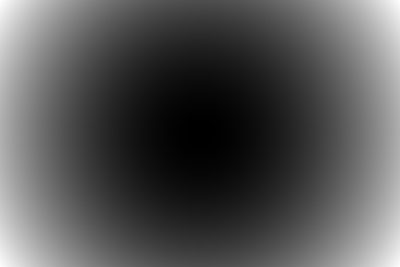
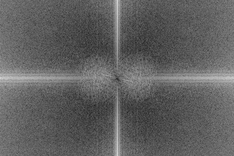
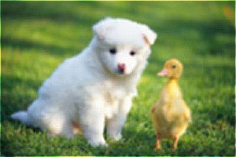
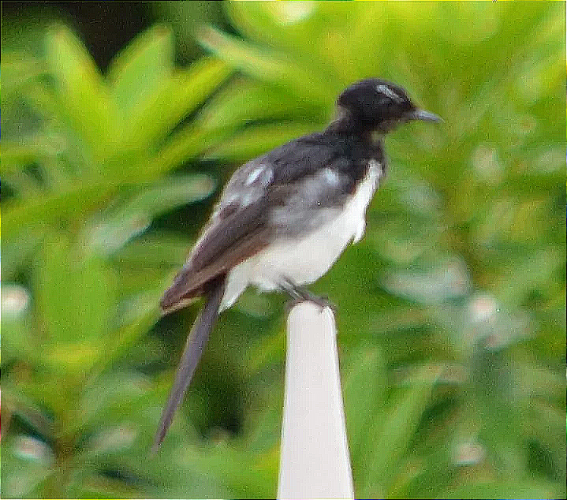

# HW4 — Image Sharpening (Spatial & Frequency Domain Laplacian)

> 交大 影像處理 — Homework 4
> Implement Laplacian filter sharpening in **two equivalent paths**:
> a hand-written spatial-domain convolution and a frequency-domain FFT
> pipeline, then compare them.

---

## 1. Task Overview

Per the assignment spec, this homework has two tasks:

| Task | Domain | Constraints |
|---|---|---|
| **1** | Spatial | Hand-write convolution (no `cv2.filter2D` / `scipy.signal.convolve2d`); explicit `zero` / `replicate` boundary handling; multiple Laplacian kernels |
| **2** | Frequency | `np.fft` allowed; build `H(u,v)` in centered frequency plane; multiply spectrum; `ifftshift` → `ifft2` → take real part; combine with original |

The deliverable: **method, results, discussion** in `113950011.pdf` plus
source code in `113950011.zip`.

---

## 2. Showcase

The 4×2 grid below combines the original image, the frequency-domain
sharpening result, and the six spatial-domain configurations
(4-neighbor / 8-neighbor / 5×5 LoG, each in `zero` and `replicate`
padding):



### Frequency-domain pipeline (img02)

| Stage | Visualization |
|---|---|
| Original |  |
| Spectrum &nbsp; `log(1+|F|)` |  |
| Laplacian filter `|H(u,v)|` |  |
| Filtered spectrum |  |
| Sharpened (frequency) |  |

The filter is dark at the center (DC = 0, so smooth/average components
pass through unchanged) and bright toward the corners (high frequencies
are amplified) — exactly the characteristic shape of a Laplacian.

---

## 3. Project Structure

```
HW4/
├── HW4.pdf                        # Original assignment spec
├── 113950011.pdf                  # Final report
├── 113950011.zip                  # Submission archive (src/ + images/)
├── README.md                      # This file
├── images/                        # 3 test images
│   ├── img01.webp                 # Slightly-out-of-focus bird
│   ├── img02.jpg                  # Puppy + duckling (main demo)
│   └── img03.jfif                 # Kitten
├── src/
│   ├── utils.py                   # Image I/O + visualisation helpers
│   ├── spatial_laplacian.py       # Task 1: spatial pipeline
│   ├── frequency_laplacian.py     # Task 2: frequency pipeline
│   └── make_comparison.py         # Builds the 4×2 grids in results/comparison/
└── results/
    ├── spatial/                   # 14 PNGs per image
    ├── frequency/                 # 7 PNGs per image
    └── comparison/                # 1 grid per image
```

---

## 4. Implementation Highlights

### 4.1 Spatial — handcrafted convolution

`spatial_laplacian.py`

- **Padding** (`pad_image_2d`): both `zero` and `replicate` modes,
  written by hand with numpy slicing — no `np.pad`-style helpers in the
  hot path.
- **Convolution** (`convolve2d_gray`): vectorised over pixels, loops over
  kernel positions only. The kernel is flipped so the operation is
  *true* convolution (matters for asymmetric kernels). Output shape
  matches input.
- **Kernels** (positive-center form so `g = f + c · L(f)`):

  | Kernel | Center | Layout |
  |---|---|---|
  | 4-neighbor 3×3 | +4 | `[[0,-1,0],[-1,4,-1],[0,-1,0]]` |
  | 8-neighbor 3×3 | +8 | `[[-1,-1,-1],[-1,8,-1],[-1,-1,-1]]` |
  | 5×5 LoG | +16 | Gaussian-smoothed Laplacian |

- **Per-kernel `c`** to keep visual intensity comparable:
  4n: `c = 1.0`, 8n: `c = 0.5`, LoG: `c = 0.25`. Without this,
  LoG would be ~4× stronger than 4n and produce halos.

### 4.2 Frequency — FFT-based filtering

`frequency_laplacian.py`

```text
F        = np.fft.fft2(f)
F_shift  = np.fft.fftshift(F)
H(u,v)   = +4π² · D²(u,v),  D²(u,v) = (u-M/2)² + (v-N/2)²
H_norm   = H / max|H|                          (so c is size-invariant)
G_shift  = H_norm * F_shift
g        = real( ifft2( ifftshift(G_shift) ) )
sharp    = f + c · g
```

The sign convention (`H_pos = +4π²·D²` instead of the textbook
`-4π²·D²`) is chosen so the same `g = f + c·L(f)` formula works in both
domains.

### 4.3 What is verified internally

A separate (non-submitted) test suite checks:

- `pad_image_2d` ≡ `np.pad` for both modes
- `convolve2d_gray` ≡ `scipy.signal.convolve2d` (used only as ground truth)
- Flat region → zero response, DC of response ≈ 0
- Impulse response equals the kernel
- Color-image path equals per-channel application
- High-frequency cosine is amplified by the frequency pipeline; DC preserved

---

## 5. How to Run

### Dependencies

```
python      ≥ 3.10
numpy
matplotlib
Pillow      (with AVIF/WEBP support)
```

### Reproduce all results

From the project root:

```bash
# Task 2 (Frequency) — fast
python src/frequency_laplacian.py

# Task 1 (Spatial) — slower, hand-rolled convolution
python src/spatial_laplacian.py

# Build the polished side-by-side grids
python src/make_comparison.py
```

Each pipeline auto-discovers images in `images/` and writes outputs to
its corresponding `results/...` folder.

---

## 6. Results

### 6.1 Padding comparison (zero vs replicate)

`zero` padding leaves a faint dark/bright halo on the outermost row/column
because the boundary is treated as a sharp edge against zero;
`replicate` padding suppresses this artifact by extending the boundary
pixel value outward.

| zero-padding | replicate-padding |
|---|---|
|  |  |

### 6.2 Spatial vs Frequency

| Original | Spatial 8n + replicate | Frequency |
|---|---|---|
|  |  |  |

Both directions sharpen as expected. The frequency-domain result has
slightly stronger high-frequency emphasis because `H = 4π²·D²` is
unbounded at high frequencies, whereas the 3×3 spatial kernel saturates
at finite gain.

### 6.3 Restoring a defocused image (img01)

| Original (defocused) | Spatial 8n | Frequency |
|---|---|---|
|  |  |  |

Laplacian sharpening is high-frequency *re-emphasis*, not true
deconvolution — the bird's outline becomes crisper and feather edges
return, but defocus blur cannot be fully reversed without knowing the
blur kernel.

---

## 7. Discussion (summary)

The full discussion lives in `113950011.pdf §4`. Highlights:

- **Per-kernel `c` is essentially an implicit kernel normalization.** The
  textbook 4n / 8n / LoG kernels have center magnitudes 4 / 8 / 16, so
  with a shared `c` the LoG result is ~4× stronger than 4n and over-
  shoots. Picking `(1.0, 0.5, 0.25)` makes the visible sharpening level
  comparable across kernels while keeping each kernel in its
  pedagogically standard form.
- **Cyclic vs linear convolution.** The spatial path performs linear
  convolution with explicit padding; FFT performs cyclic convolution
  (top wraps to bottom, left to right). For images with strong edge
  intensity differences this can introduce subtle ringing along the
  borders; padding to 2× before FFT would remove it but is not part of
  this assignment's spec.
- **Complexity.** Spatial is `O(N² · k²)`; frequency is `O(N² · log N)`.
  For 3×3 kernels on sub-megapixel images, the spatial path is actually
  faster because of the small constant factor. Frequency wins on large
  images and large kernels.

---

## 8. Submission

| File | Purpose |
|---|---|
| `113950011.pdf` | Report (5 pages) |
| `113950011.zip` | Source code + test images (no results/, no internal tests) |

Filename, archive format (`.zip`), and required sections (Method /
Result / Discussion) all conform to the spec on `HW4.pdf` page 6.
