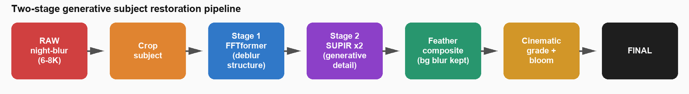
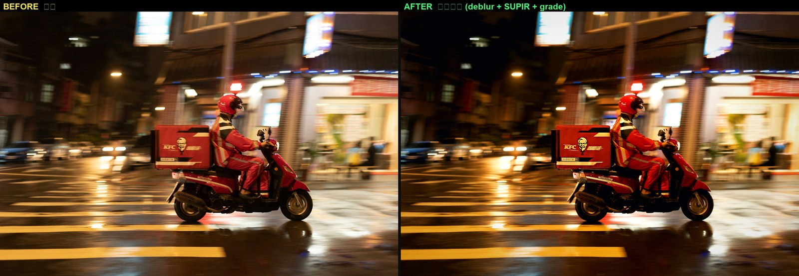
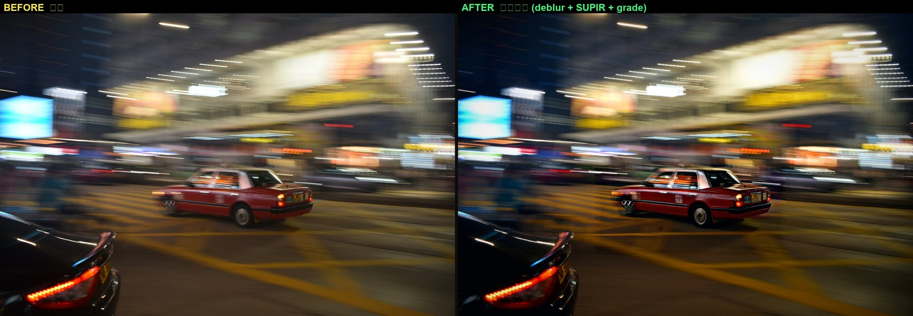

# 影像處理 Term Project — 夜間運動模糊影像修復

NYCU 影像處理 · Term Project

**組員**：113950011 鄭名翔 · [id] [teammate] · [id] [teammate]

---

## 任務

15 張夜間 / 低光、含 motion blur 的真實照片（6K–8K，無 ground truth），從近年開源 deblurring 方法挑選並改進，自選 2 張最佳結果繳交。

挑戰：低光 + noise + 大尺度 blur kernel + 高解析度 + 夜景分布 OOD。

---

## 方法概要

基礎方法為 FFTformer (CVPR 2023) frequency-domain transformer 去模糊（RealBlur-J pretrained）。在其上提出兩個改進：

1. 解析度策略：回歸式去模糊的最佳解析度與 blur kernel 大小成反比（重度 zoom blur 要 downscale，輕度 panning 用高解析度 tiling）；即使選對解析度，回歸式輸出仍偏平滑。
2. 生成式補高頻：以 SUPIR (CVPR 2024) 的擴散先驗補回回歸模型缺少的紋理。

完整管線：裁視覺中心主體 → FFTformer（提供結構）→ SUPIR-v0F ×2（生成細節）→ 羽化合成（保留背景追焦模糊）→ 後製調色。最後一步以自寫程式 `cinematic_grade.py`（OpenCV/NumPy）完成，全程未使用 Photoshop 等封閉工具。

<p align="center"></p>

完整方法、對照實驗與未採用的方向（整張 vs 裁主體、人臉、DiffTSR 中文文字）見 `report/Report.pdf`。

---

## 主要結果

繳交 2 張：08 KFC 外送員、05 紅色計程車。主體補回 FFTformer 輸出缺少的高頻紋理，背景保留追焦模糊。MUSIQ 分三階段，顯示增益來自去模糊而非調色：

| 影像 | RAW | 去模糊（未調色） | FINAL（含調色） |
|---|---|---|---|
| 08 KFC 外送員 | 35.44 | 42.27 | 40.76 |
| 05 紅色計程車 | 28.55 | 51.04 | 50.57 |

<p align="center"></p>
<p align="center"></p>

繳交檔位於 `final_submissions/SUPIR_2026-06-03/`。

---

## Repo 結構

```
.
├── README.md
├── Term Project.pdf                 作業規格（課程材料）
├── Images/                          15 張原圖（題目提供，.gitignore 排除）
├── scripts/                         所有程式碼
│   ├── preprocess.py / unsharp.py / masked_sharpen.py
│   ├── run_pipea_v2.py              Pipe A v2 baseline（前一代方法）
│   ├── run_perimage_v3.py           解析度策略（per-image resolution）
│   ├── run_supir_batch.py           兩階段 FFTformer→SUPIR 主體修復
│   ├── run_scale2.py                SUPIR scale ×2
│   ├── run_whole_finals.py          整張 SUPIR（對照）
│   ├── cinematic_grade.py           後製調色（OpenCV/NumPy）
│   ├── supir_api.py                 headless 驅動 ComfyUI SUPIR
│   ├── compute_musiq_final.py       重現報告第 6 節的 MUSIQ 數字
│   ├── compute_iqa.py / plot_*.py   NR-IQA 評分與視覺化（baseline 比較）
│   ├── build_plans.py               生成舊 Pipe A 繳交資料夾（對照用）
│   └── md_to_pdf.py / make_report_figures.py
├── report/
│   ├── Report.md / Report.pdf       書面報告
│   ├── figures/                     報告用圖（rpt_*）
│   └── PPT_outline.md               課堂報告投影片大綱
├── final_submissions/
│   └── SUPIR_2026-06-03/            最終 2 張 + 對比圖 + README
└── results/                         輸出（.gitignore 排除，可由腳本重跑）
```

---

## 復現

### 環境
- **`deblur`** conda env：FFTformer，PyTorch 2.11+cu128（RTX 5070 Ti / Blackwell sm_120），pyiqa。
- **`comfy`** conda env：ComfyUI + [kijai/ComfyUI-SUPIR](https://github.com/kijai/ComfyUI-SUPIR)，與 deblur 隔離以保護 sm_120 torch。
  - 模型：`SUPIR-v0F_fp16.safetensors`（[Kijai/SUPIR_pruned](https://huggingface.co/Kijai/SUPIR_pruned)）+ `RealVisXL_V4.0_Lightning.safetensors`（SDXL base）。

### Model weights
- **FFTformer**：[kkkls/FFTformer](https://github.com/kkkls/FFTformer)，`pretrain_model/Realblur/net_g_Realblur_J.pth`
- **SUPIR / RealVisXL**：見上。

### 跑主管線
```bash
# 1) 兩階段主體修復（FFTformer 結構 -> SUPIR 細節）
python scripts/run_supir_batch.py        # 需先啟動 ComfyUI server (comfy env)
# 2) SUPIR scale x2
python scripts/run_scale2.py
# 3) 後製調色（自寫 OpenCV/NumPy 程式，非 Photoshop），輸出最終
python scripts/cinematic_grade.py
# 4) 量化（MUSIQ）+ 報告圖檔 + PDF
python scripts/compute_musiq_final.py
python scripts/make_report_figures.py
python scripts/md_to_pdf.py
```

啟動 ComfyUI SUPIR server：`comfy_python C:\Users\user\ComfyUI\main.py --port 8188`，再以 `scripts/supir_api.py` headless 驅動。

---

## 限制與未來方向

- **Glass reflection / 多重曝光**（02、15）：layer separation 問題，需 reflection removal。
- **生成式 fidelity**：人臉 identity drift、中文品牌字無法還原為正確字（資訊已被模糊物理抹除）。
- **未來**：真實 paired night-blur fine-tune；deep reflection removal；brand-font-aware 中文文字修復。
