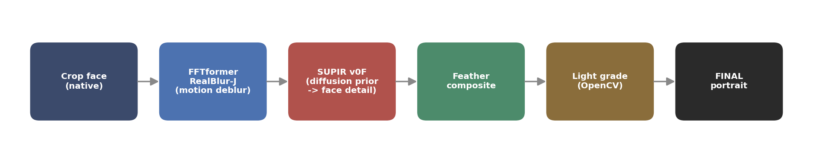
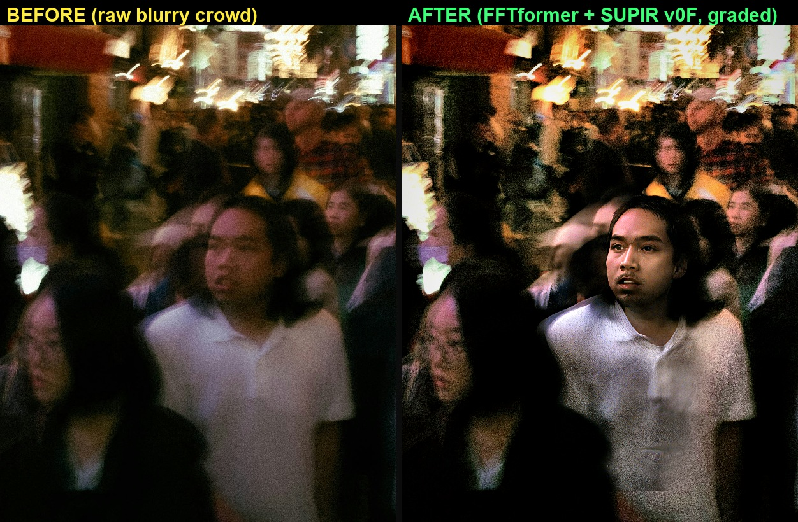
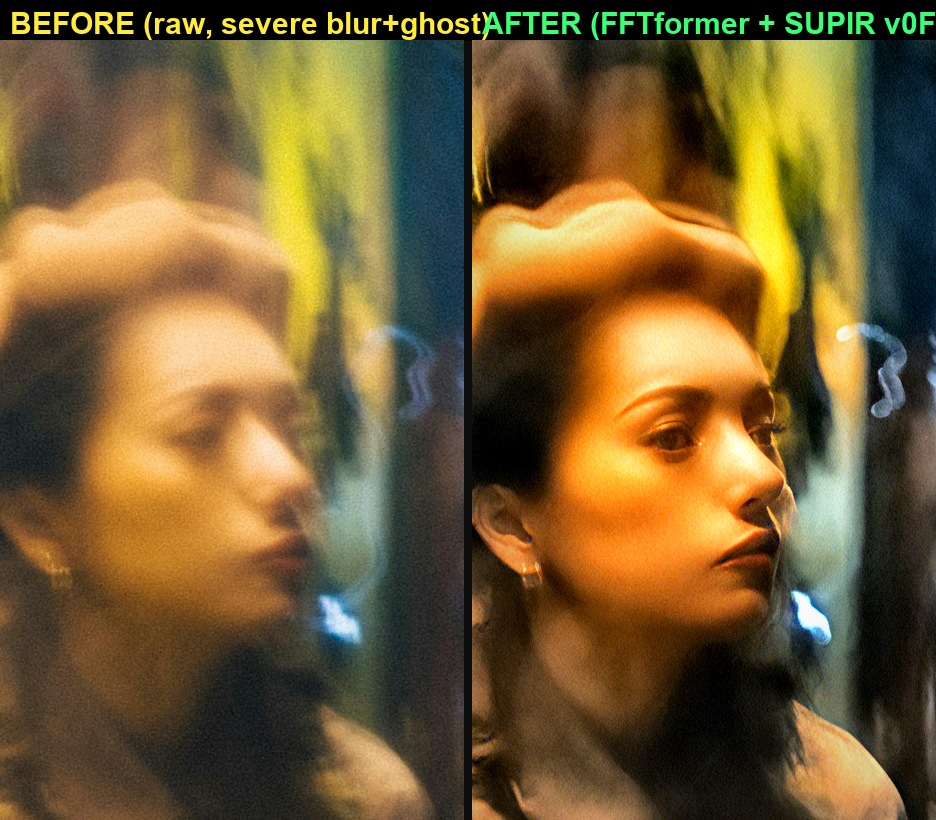
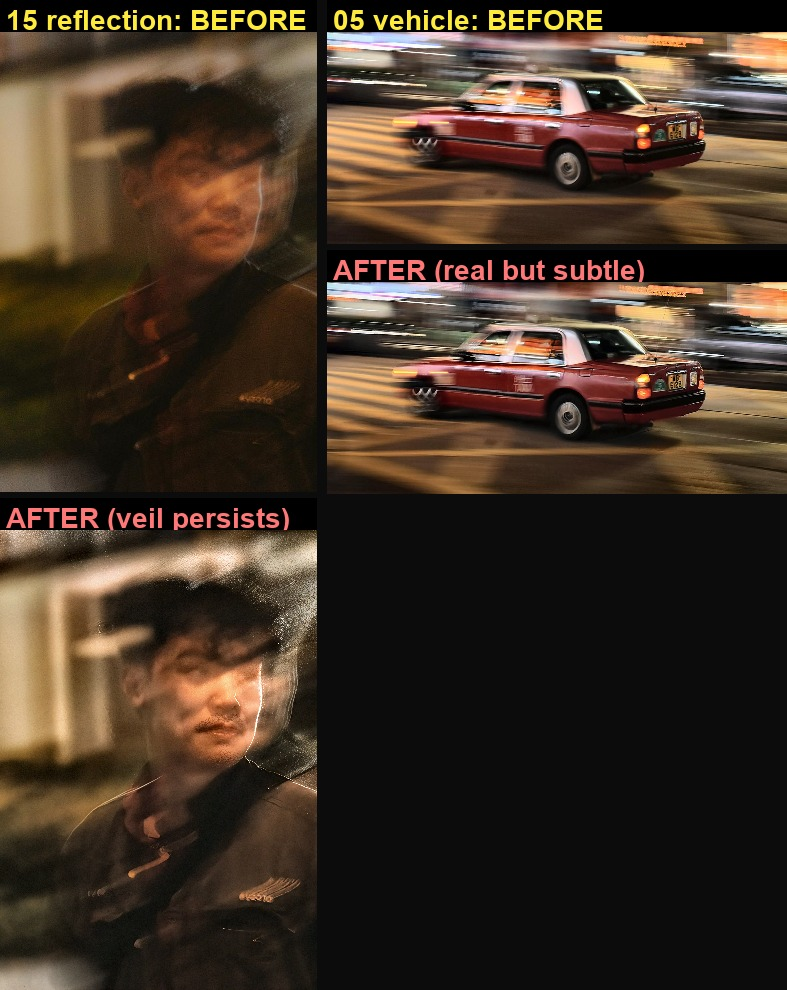

# 夜間運動模糊的人臉修復：回歸式去模糊結合生成式先驗

NYCU 影像處理 · Term Project

組員：113950011 鄭名翔 · [id] [teammate] · [id] [teammate]（方法設計、實驗與報告由三人共同完成）

---

## 摘要

題目給定 15 張夜間真實照片（6K–8K、含運動模糊、無 ground truth）。作業範例展示的是「模糊人臉 → 清晰人臉」的修復，我們以此為目標：先以 FFTformer (CVPR 2023) 去除運動模糊，再以 SUPIR (CVPR 2024) 的擴散先驗補回回歸模型補不出的臉部高頻，設計「裁臉 → FFTformer → SUPIR-v0F → 羽化合成」的人臉修復管線。最終自選兩張不同場景的「模糊路人 → 清晰真人」肖像繳交，並據實區分 #1（五官 layout 真實、高頻由先驗合成）與 #2（眼睛為生成）。

---

## 1. 任務與挑戰

輸入為 15 張夜間 / 低光、含運動模糊 (motion blur) 的真實照片，解析度 6K–8K，無 ground truth，故不能使用 PSNR / SSIM，只能採 No-Reference IQA 與人眼互評。作業投影片給的範例正是 blurry face → sharp face（GFPGAN / GPEN 風格）。核心難點是低光、雜訊、大尺度模糊核 (blur kernel) 與高解析度同時存在，且夜景分布對多數模型屬 out-of-distribution。我們的設計目標是做出前後差異最明顯的 before / after：能真實還原的就還原，無法還原的部分（如被運動重影破壞的五官）則以生成補上並據實標示（見第 5 節）。把整張畫面變清楚並非必要，背景的動態模糊本身具速度感。

---

## 2. 採用的論文方法

本管線使用兩個開源、可執行的已發表方法，皆滿足作業「能成功執行某篇論文方法」的要求：

- **FFTformer (CVPR 2023)**：把 self-attention 與 feed-forward 放到頻域 (FFT) 運算的 transformer，論文報告於 RealBlur-J 上達當時 SOTA。我們以其 RealBlur-J 預訓練權重 `net_g_Realblur_J.pth` 成功執行。
- **SUPIR (CVPR 2024)**：以 SDXL 擴散先驗做影像修復，我們使用其 v0F 權重。

我們也測試過 DarkIR (CVPR 2025，實測僅提亮去噪) 與 MISCFilter (CVPR 2024，去模糊有限) 作為對比。

回歸式 (regression) 去模糊（FFTformer）學的是 blur → sharp 的映射。當高頻已被運動模糊抹除，尤其在臉這種高頻密集的區域，模型沒有足夠資訊可還原，輸出會偏軟且帶噪。

*夜市男子：RAW ｜ FFTformer ｜ FFTformer→SUPIR。FFTformer 把臉的結構拉乾淨，但仍偏軟、雜訊明顯；要靠 SUPIR 的擴散先驗才補回清晰的臉部高頻。這組對照顯示 Stage 2（SUPIR）的貢獻。*

---

## 3. 方法：回歸去模糊 + 生成式臉部先驗

每張臉的管線：

1. 裁出視覺中心人臉（native 解析度），取得最高臉部有效解析度。
2. **Stage 1 — FFTformer (RealBlur-J)** 去運動模糊，提供乾淨且 kernel 在訓練範圍內的結構。解析度視 kernel 大小而定：女子的運動核大，先縮到 max-side 1024 把 kernel 縮回範圍；男子的裁切較小、模糊較輕，直接在 native 解析度去模糊。
3. **Stage 2 — SUPIR-v0F**（SDXL 擴散先驗）在乾淨結構上合成臉部高頻。control_scale 由 0 線性升到 1.0（control_scale_start = 0）：前段取樣讓先驗形成結構、後段強錨定輸入；其餘參數依影像調整：男子 cfg 1.5、scale ×2.0、steps 10；女子 cfg 1.3、scale ×1.5、steps 14。color fix = Wavelet，16 GB 以 tiled VAE / tiled sampling 完成。
4. 羽化合成回原圖（男子）或裁切 SUPIR 結果（女子）：臉部銳利、背景保留動態模糊，使對照圖是同一張照片的主體 before / after，而非整張重算。
5. 後製呈現層（非修復步驟）：以 OpenCV / NumPy 做輕度調色（對比、暖調、主體暈影），未使用 Photoshop 等封閉式工具。輸出另存未調色版（`*_FINAL_ungraded.png`），以便分離去模糊與調色的貢獻。

---

## 4. 主要結果

最終自選 2 張不同場景的「模糊 → 清晰真人臉」繳交（檔案於 `final_submissions/Faces_2026-06-04/`）。

*#1 夜市男子（正面）：清晰真人臉自一片動態模糊的人群中浮現，背景保留動態模糊。*

*#2 霓虹巷弄女子（3/4 側臉，影像 14 主體的裁切）：前後對比最強的一張，其眼部為生成（見第 5 節）；上方的運動重影留作柔和動態模糊。*

無 ground truth，我們以 native 解析度的人眼檢查為主要評估。FFTformer-only vs FFTformer→SUPIR 的消融對照見第 2 節，數個未採用方向的對照見第 6 節。

---

## 5. Fidelity：真實結構約束 vs 生成合成

兩張臉的細節清晰度都由擴散先驗合成（屬 prior-guided restoration，與作業範例的 GFPGAN / GPEN 同為先驗導引的生成式修復，差別在 GAN 先驗與擴散先驗），不是逐像素的解卷積。差別在於「有多少真實結構可供約束」，是程度差異，不是本質差異：

- **#1 夜市男子**：雙眼、鼻、口、髮際在原圖中可辨識（單向運動模糊、無重影）；高頻細節同樣由先驗合成，但 layout 由後段高 control 取樣緊貼原圖，偏離原貌的空間小。
- **#2 霓虹女子**：下半臉（鼻、唇、下巴、耳環）有真實結構可依；但原圖該人頭部有運動重影 (double-image)，眼睛與上半臉的高頻已被物理抹除，該區的細節是在缺乏真實依據下生成的。

*以不同隨機種子重跑，受真實結構約束的特徵（下巴、3/4 側臉）大致一致，顯示生成是可重現且受 layout 約束的。但一致不等於忠實：一致而錯誤的臉同樣穩定。SUPIR 提示詞又指定了「對稱雙眼」與「耳環」，故這兩項的一致性部分來自提示詞。眼睛是生成區，不應視為真實。*

對 #2，我們是有意識地把視覺對比放在 fidelity 之前；正因為眼睛超出可信還原的範圍，才在此明確標示為生成。這條界線在繳交說明與互評中都會講清楚：呈現的是可信的修復，生成的部分不主張為真實像素。

---

## 6. 驗證過、未採用的方向

- **純車輛去模糊（05 紅 taxi、08 KFC）**：FFTformer 真實去模糊、零生成、可完全辯護，但這些主體本就部分可辨，前後對比偏小（上圖右）。
- **玻璃反射（15 攝影師）**：反射疊影是 layer separation 而非模糊，FFTformer 與 SUPIR 都去不掉，臉仍朦朧（上圖左）。
- **整張 SUPIR**：對整張圖跑 SUPIR 會把背景人群幻覺成扭曲臉；14 整圖更會在主體旁生出第二張臉。我們繳交的 #2 正是改用「裁臉 + 高 control + 裁掉幻覺邊緣」後的 14 主體（見第 5 節），而非整圖修復。

---

## 7. No-Reference IQA 的侷限

本題無 ground truth，只能用 No-Reference IQA，但不同指標偏好不同：NIQE 偏好自然影像統計、會懲罰激進增強；NRQM 偏好銳利邊緣，方向與 NIQE 相反；MUSIQ 與 MANIQA 較貼近人眼。任何單一 NR-IQA 都無法區分「真實清晰」與「生成幻覺」，故我們以人眼（同儕互評）為最終依據，並刻意不列單一 NR-IQA 分數：對被生成補上的臉，NR-IQA 反而可能給高分，列出來會誤導。實驗證據以第 2 節的消融與第 6 節的對照為主。

---

## 8. 限制與未來方向

- 玻璃反射 / 多重曝光（02、15）本質是 layer separation，需 reflection removal 類方法。
- 生成式 fidelity 有上限：被運動重影物理抹除的五官（即 #2 的眼睛 / 上半臉，見第 5 節）無法真實還原，只能可信生成。
- 未來可改用臉部專用修復（CodeFormer / GFPGAN 帶 fidelity 旋鈕 -w）、以真實 paired night-blur 資料微調、並整合 deep reflection removal。

---

## 9. 復現

- 環境：`deblur` conda env（FFTformer，PyTorch 2.11+cu128，RTX 5070 Ti / Blackwell sm_120）；`comfy` conda env（ComfyUI + SUPIR，與 deblur 隔離以保護 sm_120 torch）。
- 模型：FFTformer RealBlur-J、SUPIR-v0F、SDXL base 為 RealVisXL V4.0 Lightning（社群開源的 SDXL-Lightning 蒸餾權重，作為 SUPIR 的擴散底模，非靜默替換）。
- 一鍵重現：先啟動 ComfyUI SUPIR server，再 `python scripts/run_face_restore.py`（管線見第 3 節；內部呼叫 `FFTformer/run_fftformer.py` 與 `scripts/supir_api.py`，完成後把兩張成品寫入 `final_submissions/Faces_2026-06-04/`）。每張臉的裁切框與參數記於該腳本的 `FACES` 設定。
- 繳交檔：`final_submissions/Faces_2026-06-04/`。
