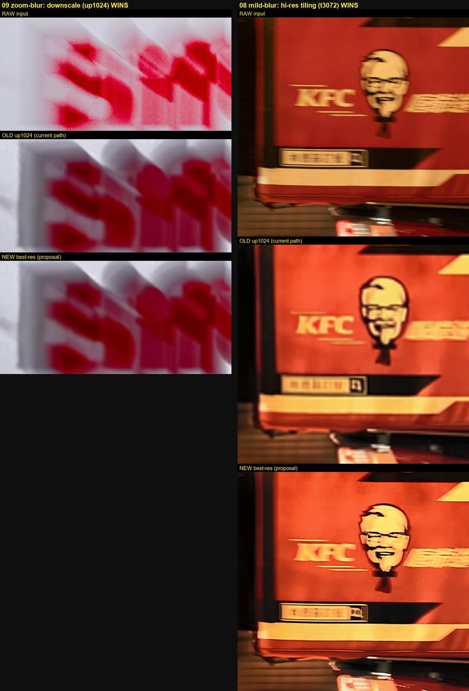
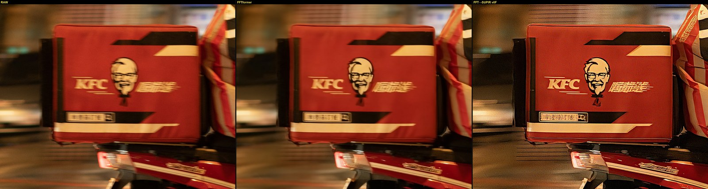
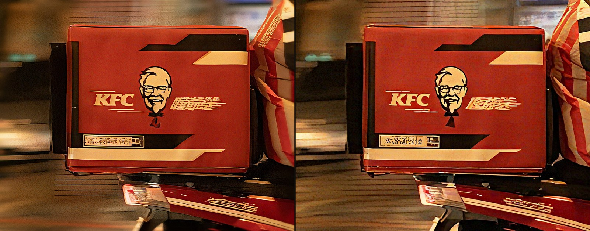
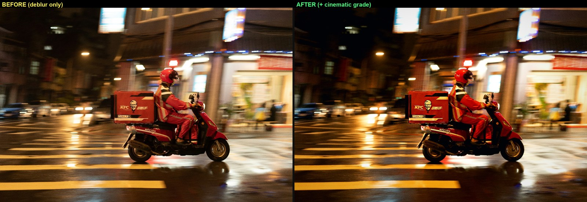
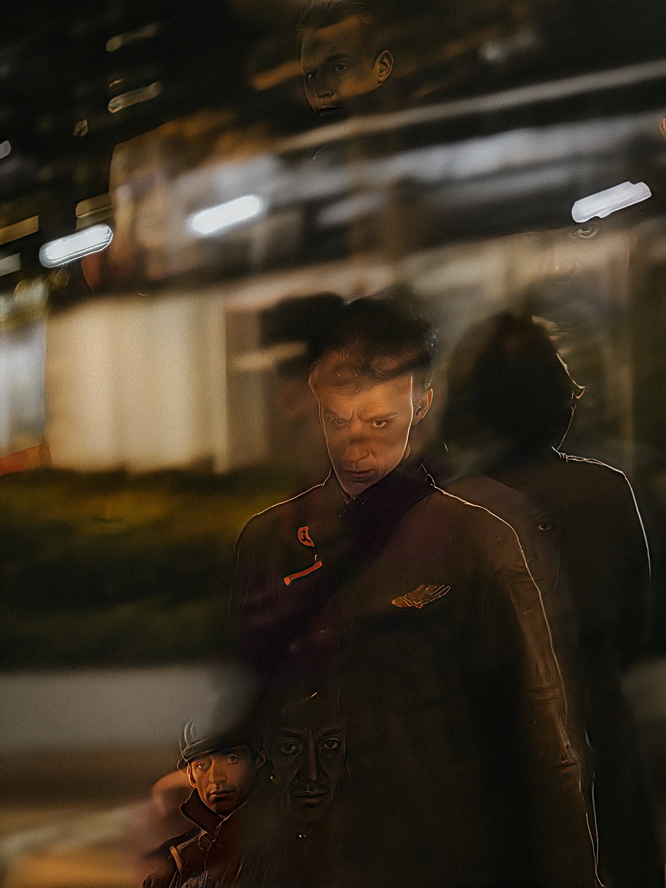
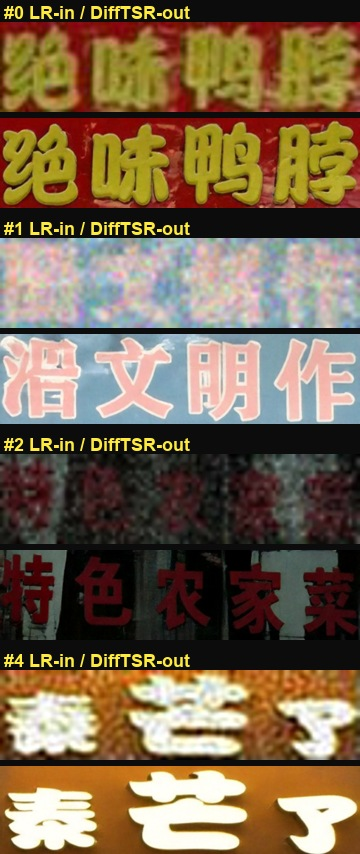
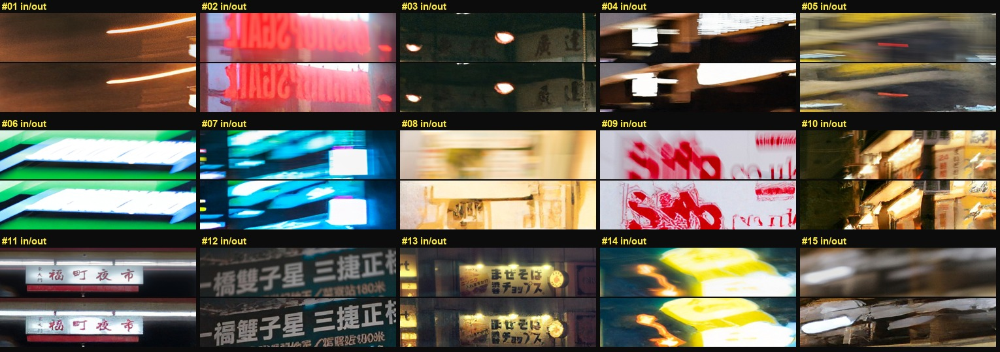

# 夜間運動模糊影像修復：從回歸式去模糊到生成式主體修復

NYCU 影像處理 · Term Project

組員：113950011 鄭名翔 · [id] [teammate] · [id] [teammate]（方法設計、實驗與報告由三人共同完成）

---

## 摘要

題目給定 15 張夜間真實照片（6K–8K、含運動模糊、無 ground truth）。我們先成功執行 FFTformer (CVPR 2023) 作為基礎去模糊方法，並提出兩項改進：先研究回歸式模型的解析度策略，發現其品質受 blur kernel 尺度限制且輸出偏平滑；再以 SUPIR (CVPR 2024) 的擴散先驗補回回歸模型缺少的高頻細節，設計兩階段 FFTformer→SUPIR 的主體修復管線，並以羽化合成保留背景的追焦動態模糊。最終兩張繳交影像的 MUSIQ 由去模糊本身帶來明顯提升（08：35.4→42.3，05：28.6→51.0）。我們也記錄了數個未採用方向（整張修復、人臉、DiffTSR 中文文字修復）的對照結果，作為方法與資料是否匹配的討論。

---

## 1. 任務與挑戰

輸入為 15 張夜間 / 低光、含運動模糊 (motion blur) 的真實照片，解析度 6K–8K，無 ground truth，因此不能使用 PSNR / SSIM，只能採 No-Reference IQA 與人眼互評。模糊種類混雜：panning（追焦）、zoom blur、手震、玻璃反射多重曝光。核心難點是低光、雜訊、大尺度模糊核 (blur kernel) 與高解析度同時存在，且夜景分布對多數以白天 / 合成資料訓練的模型屬於 out-of-distribution。

---

## 2. 採用的論文方法（baseline）

基礎方法為 FFTformer (CVPR 2023)，一個將 self-attention 與 feed-forward 放到頻域 (FFT) 運算的 transformer，論文報告其在 RealBlur-J 上為當時 (2023) 的 SOTA。我們使用其 RealBlur-J 預訓練權重 `net_g_Realblur_J.pth` 成功執行，達到「能執行某篇論文方法」的基本要求。我們也測試過 DarkIR (CVPR 2025，實測僅提亮去噪、不去模糊) 與 MISCFilter (CVPR 2024，去模糊有限) 作為對比；在我們的測試影像上，FFTformer 是最強的回歸式 (regression) baseline。

---

## 3. 改進一：回歸式去模糊的解析度策略

FFTformer 雖將 attention 降至近線性複雜度，但 6–8K 影像的中間 activation 仍超出 16 GB 顯存，無法 native 直接推論。常見作法是「縮到 max-side 1024 → 去模糊 → 放大回原尺寸」，但這樣的輸出在 native 像素尺度其實比原圖更糊（細節是上採樣來的）。

我們以 overlap-blend tiling 在多個解析度上比較，並只在 native 1:1 crop 上評估，得到一個經驗規律：去模糊的最佳解析度與 blur kernel 大小呈反比。

| 影像 | 模糊類型 | 採用解析度 | 理由 |
|---|---|---|---|
| 07 黃色計程車 | panning（輕） | 縮 3072 後 tile | kernel 不大，高解析度保留真細節 |
| 08 KFC 外送員 | panning（輕） | 縮 3072 後 tile | 同上 |
| 09 白色貨車 | zoom blur（重） | 縮 1024（不 tile） | kernel 在 native 太大、屬 OOD，需縮回訓練範圍才去得掉 |

09 屬策略推導的案例（並非最終繳交圖）：其文字只有縮小後才回得來。即使選對解析度，回歸式輸出仍偏平滑（見下節 rpt_f3）。我們由此推測 FFTformer 在此設定下接近其能力上限，並轉向生成式方法。

---

## 4. 改進二：以生成式補回回歸模型缺少的高頻

回歸式去模糊學的是 blur→sharp 的映射；當高頻已被運動模糊破壞，模型缺乏可依據的資訊，輸出傾向柔和的平均。這是一個合理的推論（rpt_f3 中 FFTformer 的輸出確實偏平滑），而非我們證明的定理。

生成式修復改用擴散模型的先驗去合成一個合理的清晰版本，能補回回歸模型變不出來的紋理。我們採用 SUPIR (CVPR 2024，基於 SDXL 的影像修復)。

*08 KFC 外送箱：RAW｜FFTformer｜FFTformer→SUPIR。FFTformer 把結構拉乾淨但偏平滑，SUPIR 補回布料紋理與 logo 邊緣等高頻。*

兩個改進在管線中互補：改進一負責提供乾淨且 kernel 在範圍內的結構，這是改進二的前置條件——若直接把壞結構交給 SUPIR，它會在錯誤的基礎上產生幻覺。因此最終管線先用 FFTformer 去模糊，再交給 SUPIR 補細節，並以低 cfg 與 Wavelet 護色讓生成忠於原主體。

---

## 5. 完整管線

1. 裁出視覺中心主體（native 解析度）。題目要的是把主體變清楚，整張變清楚既困難又非必要，背景的追焦模糊本身具速度感。
2. Stage 1：FFTformer（RealBlur-J）去模糊，提供乾淨結構。
3. Stage 2：SUPIR-v0F（scale ×2）生成細節。實際參數：steps 10、cfg 1.5、color fix = Wavelet、SDXL base 為 RealVisXL V4.0 Lightning；16 GB 以 tiled VAE / tiled sampling 完成。生成式修復在 SUPIR 補細節後解析度提高，因此 Stage 1 只需提供結構，不需在最高解析度執行。
4. 羽化合成回原圖：主體銳利、背景保留 panning 動態模糊。
5. 後製呈現層（非修復步驟）：以自寫程式 `cinematic_grade.py`（OpenCV / NumPy）做對比、teal–orange 分色、飽和度、高光 bloom、主體輕度 clarity 與暈影。全程未使用 Photoshop 等封閉式影像工具。

---

## 6. 主要結果

最終自選 2 張繳交：08 KFC 外送員、05 紅色計程車（實際上傳檔為 `08_KFC_Rider__FINAL_graded.png`、`05_Red_Taxi__FINAL_graded.png`）。

兩張皆為夜間追焦場景：主體補回了 FFTformer 輸出所缺的高頻紋理，車牌區域結構較清晰（字符為生成結果，不保證 fidelity），背景保留流動的霓虹光條。

量化以 MUSIQ（No-Reference，越高越好，於 1536px 長邊計算，RAW 同步降採樣以對齊尺度）。我們分三階段計分，以分離「去模糊」與「後製調色」的貢獻：

| 影像 | RAW | 去模糊（未調色） | FINAL（含調色） |
|---|---|---|---|
| 08 KFC 外送員 | 35.44 | 42.27 | 40.76 |
| 05 紅色計程車 | 28.55 | 51.04 | 50.57 |

MUSIQ 的提升幾乎完全來自去模糊（FFTformer→SUPIR），後製調色甚至略微降低 MUSIQ。調色的目的是提升夜景對比與人眼觀感，而非衝高指標。需注意這是最終 2 張的單點分數，僅佐證該兩張的提升，不構成方法層級的統計證據（數字可由 `scripts/compute_musiq_final.py` 復現）。

---

## 7. 對照實驗

以下方向經測試後未採用，但結論對方法選擇有參考意義。

### 7.1 裁主體 vs 整張 SUPIR

整張丟 SUPIR 會把背景的運動模糊「修」成靜態雜亂；且整張受 16 GB 限制、SUPIR 輸入像素數遠少於裁切版，主體反而較糊（上圖右）。裁主體加羽化合成（上圖左）在主體解析度與背景處理上都較佳。

### 7.2 後製調色

調色含輕度局部 clarity，屬呈現層強化，不改變主體結構（第 6 節的 MUSIQ 顯示其略微降低指標）。

### 7.3 人臉修復嘗試（未採用）

作業範例是人臉。我們對 15 號（玻璃反射攝影師）做整張生成修復，但玻璃反射造成的多重曝光人影使 SUPIR 產生多張幻覺臉、畫面陰暗混亂，不可用。此類 layer separation 場景超出單張影像修復的能力。

### 7.4 DiffTSR 中文文字修復（方法與資料不匹配）
我們測試了 DiffTSR (CVPR 2024，擴散式盲文字超解析，以 OCR 引導生成正確中文字形)。

 

左圖以 DiffTSR 官方樣本驗證：模型本身對平面店面招牌很強，能把近乎雜訊的中文還原成可讀。右圖掃描本資料集全部 15 張的文字區，無一適用：KFC 箱是裝飾性品牌字體（domain 外）、05/06/07/14 為發光霓虹 / LED、其餘招牌不是已可讀就是模糊毀損過重。當原始筆畫已被運動模糊抹除，任何模型都只能生成 smear 或錯字。這是方法與資料不匹配的案例，而非模型缺陷。

---

## 8. NR-IQA 的侷限

本題無 ground truth，只能用 No-Reference IQA，但不同指標的偏好不同：NIQE 偏好自然影像統計，會懲罰激進的增強；NRQM 偏好銳利邊緣，方向與 NIQE 相反；MUSIQ 與 MANIQA 在我們的觀察中較貼近人眼感知。因此本報告以 MUSIQ 為主，並提醒任何單一 NR-IQA 都不足以區分「真實清晰」與「生成幻覺」，最終評估仍應以人眼（同儕互評）為準。

---

## 9. 限制與未來方向

- 玻璃反射 / 多重曝光（02、15）本質是 layer separation，需 reflection removal 類方法。
- 生成式修復的 fidelity 有限：人臉會 identity drift，中文品牌字無法還原為正確字（資訊已被運動模糊抹除）。
- 未來可用真實 paired night-blur 資料對 FFTformer few-shot fine-tune、整合 deep reflection removal、並嘗試對中文字形感知的文字修復。

---

## 10. 復現

- 環境：`deblur` conda env（FFTformer，PyTorch 2.11+cu128，RTX 5070 Ti / Blackwell sm_120）；`comfy` conda env（ComfyUI + SUPIR，與 deblur 隔離以保護 sm_120 torch）。
- 模型：FFTformer RealBlur-J、SUPIR-v0F (`SUPIR-v0F_fp16.safetensors`)、SDXL base 為 RealVisXL V4.0 Lightning。
- 主要腳本（`scripts/`）：`run_perimage_v3.py`（解析度策略實驗）、`run_supir_batch.py`（兩階段主體修復）、`run_scale2.py`（SUPIR ×2）、`run_whole_finals.py`（整張對照）、`cinematic_grade.py`（後製調色）、`supir_api.py`（headless 驅動 ComfyUI SUPIR）、`compute_musiq_final.py`（重現第 6 節 MUSIQ）、`make_report_figures.py`（本報告圖檔）。
- 繳交檔：`final_submissions/SUPIR_2026-06-03/`。
