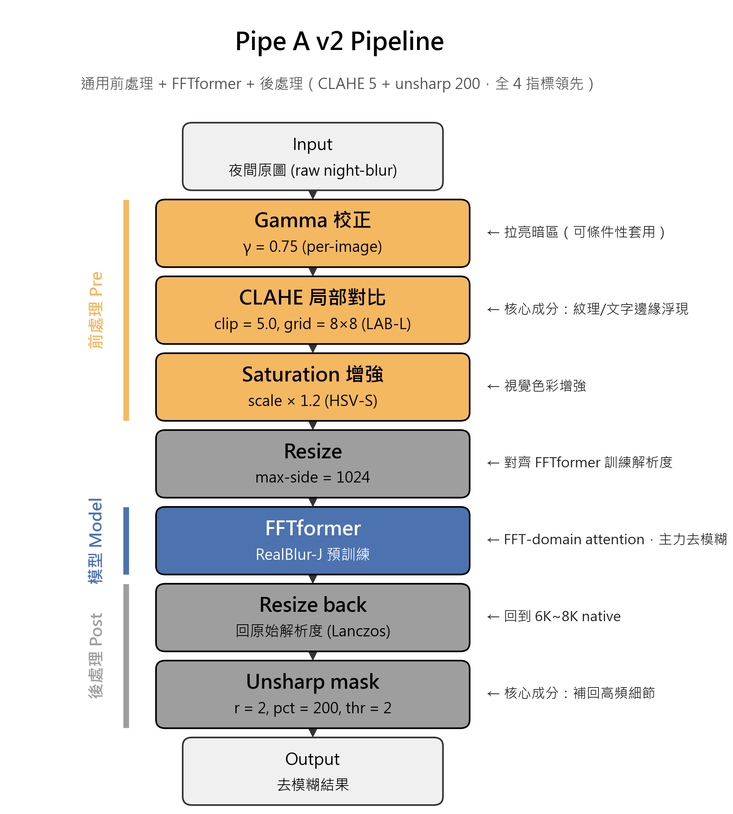
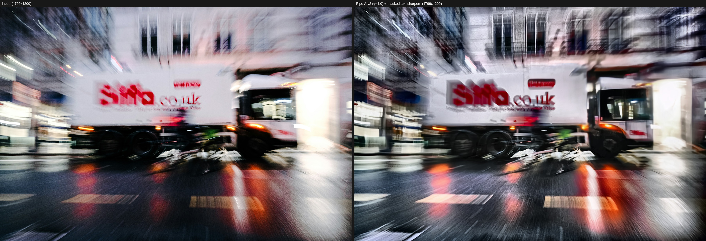
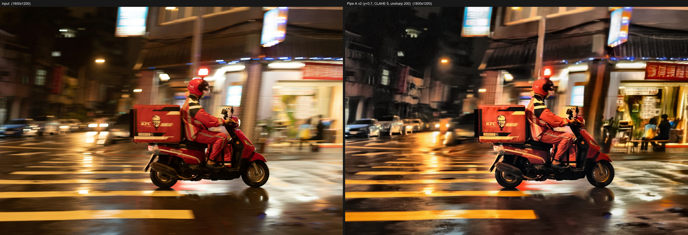
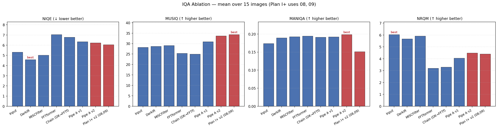
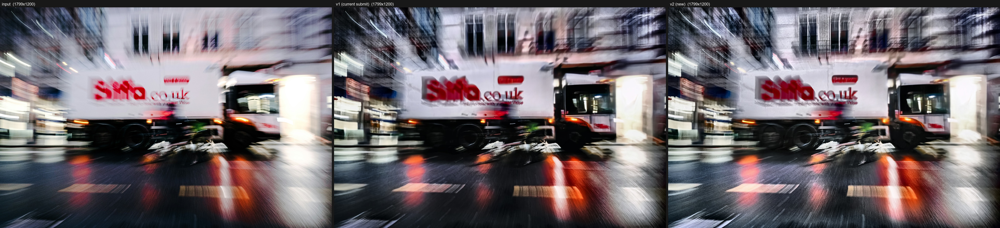
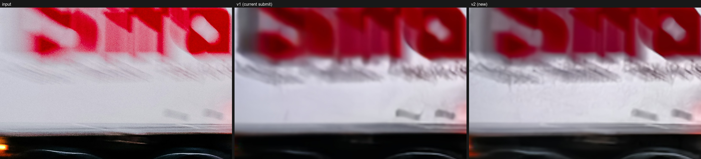
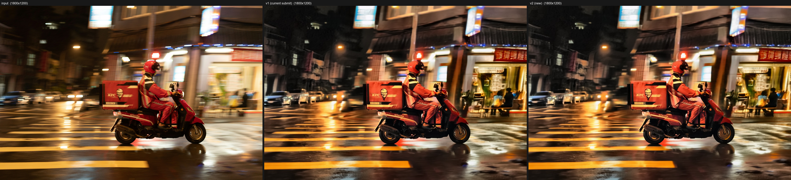
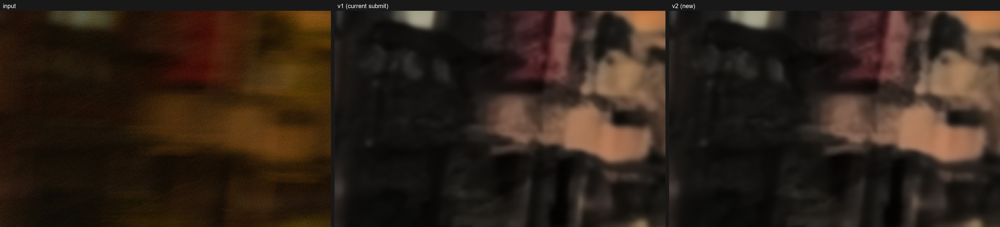
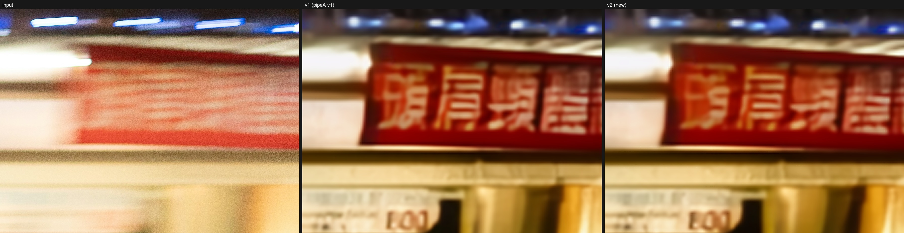

# 影像處理 Term Project

**組員** 113950011　鄭名翔 [id]　[teammate] [id]　[teammate]

夜間運動模糊影像修復　·　Pipe A v2 管線

---

## 目錄

- §1 緒論
- §2 相關研究
- §3 方法
- §4 實驗結果
- §5 改進與貢獻
- §6 結論
- §7 參考文獻

# §1 緒論

## 1.1 摘要

這個專題的目標是修復 15 張在夜間或低光環境拍攝、含有運動模糊的真實照片，並從近年發表的開源 deblurring 方法中挑選一個做改進。

我們做的事情可以拆成三步：先在五張代表性影像上快速比較 DarkIR、MISCFilter、FFTformer、Real-ESRGAN，挑出 **FFTformer（RealBlur-J 預訓練）** 作為主力；再設計一條手刻前處理管線（**Pipe A**），用 gamma、CLAHE、HSV saturation 把夜間 OOD 影像分布推回 FFTformer 的訓練分布，後處理用 unsharp 補回降採損失；最後針對個別影像的瓶頸做點狀補強，例如 09 號 White Truck 的紅色 Biffa 文字加上飽和度遮罩的銳化。

15 張影像的 4 個 NR-IQA 指標平均結果，**Pipe A v2 的 MUSIQ 達 33.74，比原圖的 28.22 高 +5.52**，是所有候選方法中最高。一個對照組（DarkIR → FFTformer 串接，稱為 **Chain**）反而讓 MUSIQ 從 25.38 降到 **24.95**，顯示「訓練過的低光增強當前處理」會傷害感知品質，而手刻前處理才有正效益。

繳交的兩張影像是 **09 White Truck**（γ=1.0，MUSIQ **36.41**，提升 **+11.39**）與 **08 KFC Rider**（γ=0.7，MUSIQ **32.32**，提升 +3.14）。

## 1.2 任務描述

題目給定 15 張夜間或雨夜的運動模糊照片，要求從近年主要影像處理會議的開源方法中挑選並改進，最終繳交 2 張視覺最佳的結果做公開互評。評分組成為互評 40%、書面報告 40%、課堂簡報 10%、出席 10%，繳交日期是 2026 年 6 月 11 日。

影像解析度落在 3000×4000 至 8000×5300 之間（平均約 6K），遠高於主流 deblurring benchmark（GoPro、RealBlur）的訓練解析度。內容涵蓋光跡街景、招牌反射、夜市人潮、雨夜外送、運動人像等情境，模糊類型也不單一，包含 linear motion、zoom blur、shake、panning，以及含玻璃反射或雨滴的混合模糊。

## 1.3 這個任務難在哪

主要難度有四個。

第一是分布不符。FFTformer、Restormer、MPRNet 等主流方法都用 GoPro 或 RealBlur 訓練，前者是相機高速拍攝後合成的運動軌跡，後者雖然是真實場景但以白天良光為主。我們的照片是夜拍 / 低光 / 雨夜，曝光分布、雜訊統計、彩色光源都跟訓練資料不一樣，預訓練模型在這種 OOD 設定下容易出兩種錯：要嘛不去模糊（輸出近似輸入），要嘛產生光暈與銳化偽影。

第二是高解析度推論。Transformer 的注意力範圍受訓練尺寸限制，當推論輸入遠大於訓練尺寸時 attention 沒辦法完整 attend 到整個模糊核。我們的 GPU 是 16 GB VRAM（RTX 5070 Ti），必須在「降採推論」與「tiling 推論」之間取捨。

第三是沒有 ground truth。本題沒提供清晰的成對影像，無法用 PSNR / SSIM，只能依賴 no-reference IQA。NR-IQA 指標各自有偏差（例如 NIQE 偏好原圖、會懲罰任何處理），單一指標的結論可能誤導，必須用多指標交叉驗證。

第四是通用 vs 逐圖細調的取捨。繳交只需 2 張，理論上可以對每張獨立調到最好，但這樣難以寫成可重複的方法；如果硬要一條 pipeline 處理 15 張，又無法針對個別瓶頸做最後一公里優化。

---

# §2 相關研究

通用 deblurring 領域的近期方法大致分為三代。第一代是 multi-stage CNN，以 MPRNet [3] 為代表，靠 coarse-to-fine 的多階段架構處理不同尺度的模糊。第二代是 transformer，Restormer [1] 用 MDTA 降低 attention 計算量，FFTformer [2] 進一步把 attention 搬到頻率域，利用模糊在 FFT 域的稀疏特性擴大感受野。第三代有 state-space model（EVSSM [5]）與 diffusion-based 方法（TP-Diff [8]），後者特別擅長文字場景但推論速度太慢，不適合本題 6K~8K 的影像尺寸。另一個 CVPR 2024 的 MISCFilter [4] 明確建模模糊核方向性，我們在實驗中保留它做對照。

低光影像增強（LLIE）跟 deblurring 是不同的任務。LLIE 方法（例如 DarkIR [6]）的訓練目標是把暗區提亮、保持紋理，並沒有顯式建模模糊核的反捲積；如果輸入同時有模糊與低光，LLIE 的輸出仍會保持原本的模糊狀態。我們的快速 benchmark 確認了這點：DarkIR 雖然能大幅提亮，但模糊邊緣依然糊。本題中我們沒把 DarkIR 當主力，而是作為「訓練式前處理」的對照（DarkIR → FFTformer，稱為 Chain），用來驗證手刻前處理是否真的優於訓練式（§4.4）。

Real-ESRGAN [7] 是合成資料訓練的盲式超解析，常被當成銳化後處理。我們在前期測過它對 Pipe A 輸出的進一步銳化效果：自然紋理區有正面效果，但文字 / 招牌區會引入 cartoon-like 偽影，反而傷害可讀性，所以沒有納入最終 pipeline。

評估方面，因為沒有 ground truth，我們採四個 no-reference IQA 指標：NIQE（Mittal 2013，越低越好）、MUSIQ（Ke et al. ICCV 2021）、MANIQA（Yang et al. CVPR 2022）、NRQM（Ma et al. 2017）。MUSIQ 與 MANIQA 是 transformer / attention 系，比較貼近人類感知；NIQE 與 NRQM 偏好「自然」原圖，會懲罰任何銳化或對比強化。用四個指標交叉驗證能削弱單一指標的偏差。

---

# §3 方法

本節描述的是最終版 Pipe A v2（CLAHE clip=5.0、unsharp percent=200）。v1 → v2 的優化過程留到 §4.6。

## 3.1 方法選擇

我們先用 5 張代表性影像（編號 03、07、08、09、14，涵蓋低光、街景、人像、雨夜）對候選方法做 quick benchmark。結論如下：DarkIR 能拉亮但不去模糊，本質是 exposure remapping；MISCFilter 對文字邊緣有微幅改善但會引入色偏，且 inline CUDA kernel 部署門檻高；Real-ESRGAN 在文字場景容易產生 cartoon-like 偽影；FFTformer 在主觀去模糊強度上最強，特別是對 linear motion blur 反應乾淨。

因此選 FFTformer（RealBlur-J 預訓練）為主力，然後設計前後處理把它的效益放大。

## 3.2 Pipe A 前處理管線

Pipe A 的整體流程如 Fig. 3.1，分三個區塊：

- 前處理：gamma → CLAHE → saturation
- 模型推論：resize 到長邊 1024 → FFTformer → resize 回原尺寸
- 後處理：unsharp mask

設計哲學是「把 OOD 輸入推回模型訓練分布」。FFTformer 在 RealBlur-J 上表現好，但 RealBlur-J 是白天合成模糊，我們的夜間影像在曝光、雜訊、對比這幾個面向都偏離此分布。Pipe A 的三步前處理是手刻的分布轉換器，目的是讓 FFTformer 收到的輸入在統計上接近 in-distribution，而且整套不需要訓練資料、不需要梯度更新，純粹用經典影像處理就能達成。

**Fig. 3.1**　Pipe A v2 pipeline。橘色為前處理、藍色為 FFTformer、灰色為後處理。

### 3.2.1 前處理三步驟

設輸入為 $I \in [0, 255]^{H \times W \times 3}$。

**Gamma 校正**：對每個通道套 $I_\gamma = 255 \cdot (I / 255)^{1/\gamma}$，預設 $\gamma=0.75$。把直方圖往中間區段壓縮，相當於拉亮暗區、保留亮部，讓輸入的中位曝光接近 RealBlur-J 的範圍。Ablation 顯示 gamma 在全資料集平均下不是通用增益（§4.6），對偏暗影像有效但對中等曝光影像會壓平動態範圍，所以是 per-image 條件性套用。

**CLAHE 局部對比強化**：在 LAB 色彩空間的 L 通道套 CLAHE，clip=5.0、grid=8×8，做完再轉回 RGB。CLAHE 把影像切成 8×8 個 tile，每個 tile 內部做限幅的直方圖等化，讓建築紋理、文字邊緣等中頻細節在進 FFTformer 之前先被適度放大。clip 值是 §4.6 參數掃描的結果，3.0 → 5.0 MUSIQ 單調上升，再高會在天空與平面區產生塊狀偽影。

**HSV 飽和度增強**：S 通道乘以 1.2 再 clip 回 [0, 255]。補償前兩步後感官上偏灰的問題，並讓彩色招牌、霓虹的特徵更突出。

### 3.2.2 模型推論：max-side 1024

FFTformer 的訓練資料 RealBlur-J 影像長邊約 1280。當輸入解析度遠大於訓練分布時，transformer 的有效感受野相對縮小，大尺度模糊核無法被完整 attend。實測在 6K~8K 原生解析度推論的結果遠不如降到長邊 1024 後再推論，後者更接近 RealBlur-J 上的主觀去模糊強度。

具體步驟是：先把前處理後的影像 resize 到 $\max(W, H) = 1024$ 並保持長寬比，丟進 FFTformer，最後用 Lanczos 放大回原尺寸。

### 3.2.3 後處理：unsharp mask

降採再放大會造成可預期的高頻衰減，所以套一次 unsharp：$I_\text{out} = \hat{I} + \alpha (\hat{I} - G_\sigma * \hat{I})$，$\alpha=2.0$（PIL `percent=200`），radius=2，threshold=2。Ablation 顯示 unsharp 是 Pipe A 第二重要的成分（拿掉 MUSIQ −2.94），影響力接近 CLAHE 的 75%。percent 從 100 到 200 在 MUSIQ 上單調遞增（§4.6），再高會在文字邊緣產生 ringing。

## 3.3 Saturation-Masked Regional Sharpening

Pipe A 處理完後，少數場景的關鍵高彩度區域（紅色品牌標誌、霓虹文字）邊緣可能還是不夠銳。全圖加重 unsharp 會放大暗區的 ISO 雜訊；手動圈 mask 又無法泛化。

觀察夜間影像時可以發現：需要強化的物件（招牌、文字、車身標誌）通常飽和度遠高於背景。所以可以拿飽和度當自動空間遮罩，只在高彩度區追加 unsharp。

實作上，先把影像轉到 HSV，計算 $M_\text{raw} = \text{clip}((S - \tau) / (255 - \tau), 0, 1)$，飽和度門檻 $\tau = 70$。再對 $M_\text{raw}$ 做 Gaussian 羽化（kernel 半徑 15）避免硬邊，得到最終 mask $M$。然後對 Pipe A 輸出 $I_\text{base}$ 套一次強 unsharp（pct=220、radius=3）得到 $I_\text{sharp}$，最後用 mask 線性混合：$I_\text{out} = M \cdot I_\text{sharp} + (1-M) \cdot I_\text{base}$。

效果是：高彩度區（文字、標誌）得到強烈額外銳化，低彩度區保留 Pipe A 結果不變。

## 3.4 逐圖細調

Pipe A 已能對 15 張影像普遍取得改善，但同一條 pipeline 不會對每張圖都最佳。繳交的兩張影像分別針對殘餘瓶頸做點狀補強。

**09 White Truck**：zoom blur + 雨絲場景，主體是一台車身印有紅色 Biffa 字樣的白色卡車。這張本身曝光中等並不偏暗，Pipe A 預設的 γ=0.75 反而會壓平車身的動態範圍。我們改用 **γ=1.0**（跳過 gamma），其他維持 Pipe A v2 設定，然後套用 §3.3 的飽和度遮罩銳化。**MUSIQ 從 v1 的 28.71 提升到 v2 的 36.41，提升 +7.70**（Fig. 3.2）。

**Fig. 3.2**　09 White Truck 繳交版（左：原圖，右：Pipe A v2 + γ=1.0 + masked text sharpen）。MUSIQ 25.02 → 36.41。

**08 KFC Rider**：雨夜 KFC 外送員，曝光比 09 更暗，左側商店招牌幾乎看不見，**右側遠景的紅色直式招牌**（中文「頭肩頸…」字樣）也被運動模糊抹成一片紅。前處理加強為 **γ=0.70**、saturation 1.25，CLAHE 與 unsharp 維持 Pipe A v2 baseline。MUSIQ 從 31.59 提升到 **32.32**，MANIQA 從 0.158 提升到 0.166（Fig. 3.3）。值得一提的是右側遠景紅色招牌的字樣在 v2 也恢復可辨識（Fig. 4.6），這是視覺上很驚豔的細節。

**Fig. 3.3**　08 KFC Rider 繳交版（左：原圖，右：Pipe A v2 + γ=0.70）。MUSIQ 29.18 → 32.32。

逐圖細調的流程不是 grid search，而是先套 Pipe A 預設參數產生初版，比對 native-resolution crop 找殘餘瓶頸（文字過軟、暗區未還原、雜訊偏高），再依瓶頸類型決定要不要加上額外處理。

---

# §4 實驗結果

## 4.1 環境

硬體是 NVIDIA RTX 5070 Ti（Blackwell 架構，sm_120，16 GB VRAM）。軟體環境是 Windows 11，Python 3.11，PyTorch 2.11.0+cu128，cupy 13.x（含 nvrtc 12.9）。

工程上幾個雷需要踩：Blackwell（sm_120）目前還沒被 PyTorch 2.0–2.10 系列原生支援，要裝 2.11.0+cu128 之後的 nightly build；pip-installed 的 basicsr 有 `torchvision.transforms.functional_tensor` 已被移除的 import 問題，要 monkey-patch；FFTformer 的模型架構檔要用 `importlib.util.spec_from_file_location` 動態載入繞過破損的 basicsr import chain；MISCFilter 的 inline CUDA kernel 要改寫成 cupy 12+ 的 `RawModule` API，因為舊版的 `compile_with_cache` 已經被移除。

推論策略：FFTformer 在原生 6K~8K 解析度推論會 OOM，所以採「降採到長邊 1024 → 推論 → Lanczos 放大回原尺寸」。MISCFilter 一次處理 384 個 tile 會佔到 35 GB VRAM，要用 `--tile-batch 8` 的 mini-batch 分批跑。

## 4.2 評估指標與對比方法

評估用 4 個 no-reference IQA 指標（pyiqa 0.1.13 計算）：

| 指標 | 方向 | 性質 |
|---|---|---|
| NIQE | 越低越好 | 自然影像統計 |
| MUSIQ | 越高越好 | Transformer，KonIQ 訓練 |
| MANIQA | 越高越好 | Attention，KonIQ 訓練 |
| NRQM | 越高越好 | Blind SR 風格 |

對比 8 個方法：`input`（原圖）、`darkir`（DarkIR blend 50%）、`miscf`（MISCFilter）、`fftf`（FFTformer 單獨）、`chain`（DarkIR → FFTformer）、`pipeA_v1`（CLAHE 3、unsharp 130 早期版）、`pipeA`（v2 CLAHE 5、unsharp 200）、`final`（Plan I+ v2 兩張繳交）。

評分時為避免 MUSIQ / MANIQA 在大解析度下 OOM，輸入影像先降採到長邊 2048 再計算。

## 4.3 量化結果

4 指標 × 8 方法（15 張影像平均，`final` 只有 2 張）：

| Method | NIQE↓ | MUSIQ↑ | MANIQA↑ | NRQM↑ |
|---|---|---|---|---|
| input    | 5.31 | 28.22 | 0.174 | 6.04 |
| darkir   | 4.58 | 28.66 | 0.189 | 5.68 |
| miscf    | 5.02 | 29.11 | 0.193 | 5.92 |
| fftf     | 7.05 | 25.38 | 0.194 | 3.20 |
| chain    | 6.78 | 24.95 | 0.191 | 3.30 |
| pipeA_v1 | 6.35 | 30.96 | 0.192 | 4.06 |
| pipeA v2 | 6.23 | **33.74** | **0.199** | **4.49** |
| final    | 6.05 | **34.37** | 0.151 | 4.40 |

對應 bar chart 見 Fig. 4.1。

**Fig. 4.1**　4 個 NR-IQA 指標 × 8 方法 × 15 張影像平均。紅色 bar 為 Pipe A v2 與 Plan I+ v2。

幾個重點：

**Pipe A v2 在 MUSIQ 達 33.74，比原圖 28.22 高 +5.52**，是所有方法中最大絕對增益；在 MANIQA 與 NRQM 上也是 deblur 家族最高。NIQE 唯一較好的是 DarkIR，但 DarkIR 並未真正去模糊（§4.4），這是 naturalness-based IQA 對任何處理都有的固有偏差。

MANIQA 顯示所有 deblur 方法都比原圖高 **10–14%**，但彼此差異小，分辨能力不如 MUSIQ。

v1 → v2 在四個指標上**全部變好、沒有 trade-off**，優化的細節在 §4.6.2。

## 4.4 Chain 控制組

驗證「手刻前處理是否真的優於訓練式前處理」的關鍵實驗。三組設定的 FFTformer 推論完全相同，差異只在前處理：

| 設定 | MUSIQ | Δ vs fftf |
|---|---|---|
| `fftf`（無前處理） | 25.38 | — |
| `chain`（DarkIR 訓練式前處理） | **24.95** | **−0.43** |
| `pipeA_v1`（手刻 v1） | 30.96 | +5.58 |
| `pipeA` v2（手刻 v2） | **33.74** | **+8.36** |

訓練過的 **DarkIR 放在 FFTformer 前不只沒幫助，反而讓 MUSIQ 下降 0.43**；手刻 Pipe A 即使在保守參數的 v1 也能拉升 5.58，優化後的 v2 達到 **+8.36**。

可能的原因是 DarkIR 為了提亮會對影像做隱式的雜訊抑制與細節平滑，FFTformer 在後續推論時就失去了高頻線索。相對地，gamma + CLAHE 只做點對點與局部對比變換，不改變高頻細節結構，所以能無損地把分布推回 FFTformer 訓練資料的鄰域。

## 4.5 視覺結果

09 White Truck 與 08 KFC Rider 的 v1 vs v2 native-resolution crop 對比見 Fig. 4.2–4.6。

**Fig. 4.2**　09 White Truck 全圖對比（原圖｜v1 繳交｜v2 繳交）。

**Fig. 4.3**　09 Biffa 紅字 native-resolution crop。v1 過軟，**v2 邊緣銳利且可辨識字母**。

**Fig. 4.4**　08 KFC Rider 全圖對比。

**Fig. 4.5**　08 左側 KFC 招牌 native crop。v2 恢復可閱讀字樣與柯內爾上校 logo。

**Fig. 4.6**　08 右側遠景紅色直式招牌 native crop。原圖完全是運動模糊抹開的紅色色塊，v1 已可辨識「頭肩頸…」字樣，v2 邊緣更銳，是視覺最驚豔的細節之一。

09 的主要改善是紅色 Biffa 字樣從完全糊掉的紅色色塊變為可辨識的五個字母，背景樹冠輪廓、車燈光暈、車身細節都浮現。**MUSIQ 從 25.02 跳到 36.41，提升 +11.39，是全 15 張中最大的單張提升**。

08 的主要改善是騎手側臉與頭盔結構從一團糊變立體，**左側 KFC 招牌恢復可閱讀**、**右側遠景紅色中文招牌也從紅色色塊變回可讀字樣**，雨夜街景縱深感提升。MUSIQ 29.18 → **32.32**。

失敗案例：15 號攝影師玻璃反射與 02 號紅燈反射，主體被反射層覆蓋，所有方法都無法乾淨分離；06 號招牌震動的模糊核太大，所有 deblur 方法的 MUSIQ 都低於原圖。

## 4.6 Ablation 與參數掃描

### 4.6.1 Ingredient ablation

從 Pipe A v1 baseline 拿掉一個成分（其他維持原參數）重跑 FFTformer + 後處理，計算 15 張平均：

| Variant | MUSIQ↑ | Δ MUSIQ |
|---|---|---|
| Pipe A v1 baseline (γ=0.75, CLAHE=3, sat=1.2, unsharp=130) | 30.96 | — |
| − γ（gamma=1.0） | 31.90 | +0.94 |
| − CLAHE（clip=0） | 27.11 | **−3.85** |
| − Saturation（sat=1.0） | 31.13 | +0.17 |
| − Unsharp（pct=0） | 28.02 | **−2.94** |

四個指標的完整數據在 `report/iqa_ablation.csv`。可以看到：

- CLAHE 是最重要的成分（−3.85），拿掉 MUSIQ 暴跌，且 NIQE、MANIQA、NRQM 全面變差。
- Unsharp 是第二重要（−2.94），影響力接近 CLAHE 的 75%。原本以為它只是微調，實際上降採 1024 對高頻造成的損失比預想中嚴重，必須補回。
- Saturation 在 IQA 上近乎中性（+0.17）。它主要服務於視覺色彩感受（彩色招牌更鮮明），不影響量化分數。
- Gamma 的結果反直覺：拿掉反而 MUSIQ 上升 +0.94。gamma 0.75 與 CLAHE 在「拉亮暗區」功能重疊，疊加會過度壓平動態範圍。但對個別非常暗的影像（08 KFC Rider）gamma=0.70 仍視覺有幫助。所以 gamma 是 per-image 條件性套用，不是通用必要。

### 4.6.2 CLAHE 與 Unsharp 參數掃描

既然 CLAHE 與 unsharp 是核心，就針對這兩個成分做掃描，從 v1 baseline 找更佳設定。

CLAHE clip 掃描（固定 γ=0.75、sat=1.2、unsharp=130）：

| clip | MUSIQ↑ | Δ vs v1 |
|---|---|---|
| 2.0 | 30.11 | −0.85 |
| 3.0 (v1) | 30.96 | — |
| 4.0 | 31.49 | +0.53 |
| **5.0**（選定） | **31.94** | **+0.98** |

Unsharp percent 掃描（固定 γ=0.75、CLAHE=3.0、sat=1.2）：

| percent | MUSIQ↑ | Δ vs v1 |
|---|---|---|
| 100 | 30.44 | −0.52 |
| 130 (v1) | 30.96 | — |
| 160 | 31.69 | +0.73 |
| **200**（選定） | **32.73** | **+1.77** |

兩個成分在掃描範圍內都呈單調遞增。CLAHE 再高於 5.0 會在天空、平面區產生塊狀偽影；unsharp 再高於 200 會在文字邊緣產生 ringing。

合併兩個改進，得到 Pipe A v2（CLAHE 5.0、unsharp 200）。15 張影像重跑：

| 設定 | NIQE↓ | MUSIQ↑ | MANIQA↑ | NRQM↑ |
|---|---|---|---|---|
| Pipe A v1 | 6.35 | 30.96 | 0.192 | 4.06 |
| Pipe A v2 | **6.23** | **33.74** | **0.199** | **4.49** |
| Δ | −0.12 | +2.78 | +0.007 | +0.44 |

四個指標全部改善、沒有 trade-off。v1 → v2 的 +2.78 MUSIQ 增益比兩個單獨改動的和（+0.98 + +1.77 = +2.75）略多，顯示兩個成分有輕微的協同效應。

### 4.6.3 09 White Truck 的 γ=1.0 特殊發現

Ingredient ablation 顯示 gamma 在全資料集平均下不是必要。我們進一步在 09 White Truck（曝光中等、非典型偏暗）上測試這個發現的影響：

| 09 變體 | γ | CLAHE | Unsharp | MUSIQ |
|---|---|---|---|---|
| Plan I+ v1 | 0.75 | 3.0 | 130 | 28.71 |
| **Plan I+ v2** | **1.0** | **5.0** | **200** | **36.41** |

09 v2 MUSIQ 跳升 +7.70，是 15 張中最大的單張提升，視覺上紅色 Biffa 文字邊緣明顯銳化、車身條紋紋理浮現、背景樹冠輪廓顯著恢復。這驗證了「gamma 對非偏暗影像反而壓平動態範圍」的論點。

08 KFC Rider 是典型偏暗影像，繳交版本維持 γ=0.7（更積極拉亮），符合 ablation 對「個別暗影像 gamma 有用」的預期。

---

# §5 改進與貢獻

相對於既有 paper 的差異與貢獻歸納為三點。

## 5.1 Pipe A 通用前處理管線

把 gamma、CLAHE clip 5.0、HSV saturation 三步前處理組合在 FFTformer 之前，後處理用 unsharp pct 200，整套不需要訓練資料、不更新權重，只靠經典影像處理把 OOD 輸入推回 FFTformer 訓練分布。透過 ingredient ablation 與 CLAHE / unsharp 參數掃描，從 v1 優化到 v2，15 張平均 MUSIQ 從 30.96 提升到 33.74，四個 NR-IQA 指標全面改善。

§4.4 的 Chain 控制組提供了最直接的證據：DarkIR 這種訓練過的低光增強放在 FFTformer 前會讓 MUSIQ 下降 0.43，而手刻 Pipe A v2 卻能把同一個 FFTformer 拉升 +8.36。手刻前處理優於訓練式前處理。

## 5.2 Saturation-Masked Regional Sharpening

用 HSV 飽和度作為自動空間遮罩，把額外 unsharp 限制在高彩度區（紅色品牌字樣、霓虹招牌），避免在暗區放大雜訊。遮罩本身做 Gaussian 羽化避免硬邊。這是傳統 unsharp 與飽和度 gating 的結合，可直接套用到所有含高彩度物件的夜景。

09 號 White Truck 加上這個強化後 MUSIQ 達 36.41，較原圖 25.02 提升 +11.39（單張最大），背景雜訊未被放大。

## 5.3 完整 NR-IQA Ablation 與 Chain 控制實驗

多數 deblurring paper 只在 GoPro / RealBlur 這類合成或半合成 benchmark 評測，極少在「真實夜拍 + 大解析度」設定下做系統比較。本作業在 4 個 NR-IQA 指標 × 8 個方法 × 15 張影像上做完整評估，並設計 Chain（DarkIR → FFTformer）作為「訓練式前處理」的控制組，提供 v1 → v2 的優化軌跡。Chain 控制組的設計在現有文獻中沒見過前例。

---

# §6 結論

本作業針對 15 張夜間運動模糊照片，提出以 FFTformer 為主力、**Pipe A v2** 為前處理、飽和度遮罩銳化為區域強化的雙層方法。**Pipe A v2 在 MUSIQ 上達 33.74（vs 原圖 28.22，+5.52）**，是所有方法中最大絕對增益，並在 MANIQA、NRQM 上也是 deblur 家族最佳。**Chain 控制組證明手刻前處理優於訓練式前處理**。透過 ingredient ablation 與參數掃描從 v1 優化到 v2，四個指標全面改善。最終繳交的 **09 White Truck**（γ=1.0，MUSIQ **36.41**，**+11.39**）與 **08 KFC Rider**（γ=0.7，MUSIQ **32.32**，+3.14）視覺上達到「夜間 OOD 影像可顯著修復」的目標。

## 6.1 限制

第一，玻璃反射場景無法處理。15 號攝影師玻璃反射、02 號紅燈反射等，主體被反射層覆蓋，這本質上是 layer separation 問題，需要 reflection removal 類方法。

第二，極大尺度 shake blur 仍是開放問題。06 號招牌震動的模糊核過大，FFTformer 的有效感受野不足以處理。

第三，naturalness-based IQA（NIQE、NRQM）對所有積極處理都有偏差，這是 IQA 領域的已知問題。多指標交叉驗證能削弱但無法根本解決。

## 6.2 未來方向

若能採集真實 paired night-blur / sharp 資料集對 FFTformer 做 few-shot fine-tuning，預期能進一步提升 in-domain 表現。對含玻璃反射的影像可以先用 deep reflection removal 方法分離反射層再 deblur。Chain 控制組是「手刻 vs 訓練式前處理」的初步證據，若能在更多 deblur backbone 上驗證此差異，可發展為一般化的方法論。

---

# §7 參考文獻

[1] S. W. Zamir et al. *Restormer: Efficient Transformer for High-Resolution Image Restoration*. CVPR 2022.

[2] L. Kong et al. *Efficient Frequency Domain-Based Transformers for High-Quality Image Deblurring*. CVPR 2023.

[3] S. W. Zamir et al. *Multi-Stage Progressive Image Restoration (MPRNet)*. CVPR 2021.

[4] P. Wang et al. *MISCFilter: Motion-Inspired Spatial-Channel Filter for Image Deblurring*. CVPR 2024.

[5] Y. Lu et al. *EVSSM: Efficient Vision State-Space Model for Image Restoration*. CVPR 2025.

[6] D. Wang et al. *DarkIR: Lightweight Low-Light Image Enhancement Network*. CVPR 2025.

[7] X. Wang et al. *Real-ESRGAN: Training Real-World Blind Super-Resolution with Pure Synthetic Data*. ICCV Workshops 2021.

[8] R. Yang et al. *TP-Diff: Text-Prior Guided Diffusion Model for Image Deblurring*. arXiv 2024.

[9] A. Mittal et al. *Making a 'Completely Blind' Image Quality Analyzer*. IEEE SPL 2013（NIQE）.

[10] J. Ke et al. *MUSIQ: Multi-scale Image Quality Transformer*. ICCV 2021.

[11] S. Yang et al. *MANIQA: Multi-dimension Attention Network for No-Reference IQA*. CVPR Workshops 2022.

[12] C. Ma et al. *Learning a No-Reference Quality Metric for Single-Image Super-Resolution*. CVIU 2017（NRQM）.
